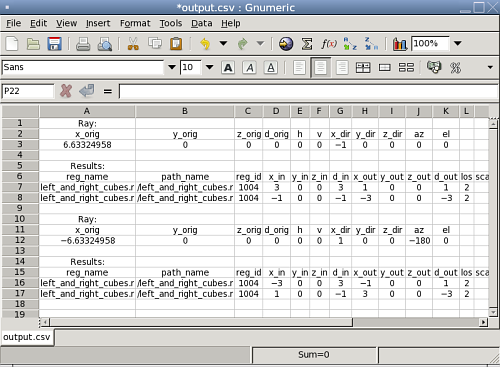

= Interactive Raytracing: The nirt Command
CliffordYapp

[[_about_nirt]]
== About [app]``NIRT``

The [app]``NIRT`` (Natalie's Interactive Ray-Tracer) command line tool provides a user-level interface to the low-level routines defining the ray tracing logic, allowing a user to specify and cast an individual ray and tailor the information reported.
It was originally written by Natalie L.
Eberius and Paul J.
Tanenbaum in the early 1990s, with additional updates by others over the years.
Significant work was done by Bob Parker in the late 1990s to integrate [app]``NIRT`` with [app]``MGED``, resulting in wireframe visualization of ray paths and the Query Ray Control Panel. 

[[_nirt_basic_syntax_and_operations]]
== [app]``NIRT``:  Basic Syntax and Operations

There are two environments within which [app]``NIRT`` can be used - inside the [app]``MGED`` interactive geometry editor and within its own command line interactive environment.
Consequently, there are three command line environments where behavior needs to be described in this document; operating system command prompt, [app]``NIRT`` command prompt, and [app]``MGED`` command prompt.
The convention used here will be: 

[cols="1,1"]
|===

|**Command Line Environment**
|**Command Type**

|Operating System Command Line Prompt
|command

|[app]``NIRT`` Command Prompt
|interactive command

|[app]``MGED`` Command Prompt
|[app]``MGED`` command
|===

=== Command Line Help

[app]``NIRT`` provides an _h_ option which prints out a list of available options and command syntax: 

....

user@machine ~ $ nirt --h
Usage: 'nirt [options] model.g objects...'
Options:
 -b        back out of geometry before first shot
 -B n      set rt_bot_minpieces=n
 -e script run script before interacting
 -f sfile  run script sfile before interacting
 -L        list output formatting options
 -M        read matrix, cmds on stdin
 -O action handle overlap claims via action
 -s        run in silent (non-verbose) mode
 -u n      set use_air=n (default 0)
 -v        run in verbose mode
 -x v      set librt(3) diagnostic flag=v
 -X v      set nirt diagnostic flag=v
....

=== Loading a Model

There will be a number of models used to illustrate various [app]``NIRT``	behaviors, all of which will be centered around regions created with various combinations of 2mm arb8 cubes.
The left cube is centered at (-2, 0, 0), the center cube at (0, 0, 0) and the right cube at (2, 0, 0).  One additional arb8 will be defined to overlap the center cube with side lengths in the z direction of 4mm.
The various models based off of these primitives will be read from a database called [path]_nirt_example.g_. 

// <informalfigure>
// 	  <mediaobject>
// 	    <imageobject role="html">
// 	      <imagedata align="center" fileref="../../articles/images/nirt_fig01.png" format="PNG"/>
// 	    </imageobject>
// 	    <imageobject role="fo">
// 	      <imagedata align="center" fileref="../../articles/images/nirt_fig01.png" format="PNG"/>
// 	    </imageobject>
// 	    <caption>
// 	      <para>
// 		Wireframe view of the three arb8 cubes which will be used to build example models for illustrating
// 		<application>NIRT</application> behavior.
// 	      </para>
// 	    </caption>
// 	  </mediaobject>
// 	</informalfigure>

Although there are many `nirt`	options available, only the database name and objects are essential to get started: 
// <cmdsynopsis sepchar=" ">
// 	  <command>nirt</command>
// 	  <arg choice="req" rep="norepeat"><replaceable>model.g</replaceable></arg>
// 	  <arg choice="req" rep="norepeat"><replaceable>objects</replaceable></arg>
// 	</cmdsynopsis>
	where _objects_ is a list of objects in the database separated by spaces.
To begin, select the object _center_cube.r_	object with interactive command line [app]``NIRT``.
The form of the command is: footnote:[To quickly find out what objects are in a database,
	    use the commands mged -c nirt_example.g tops
	    to see all top level objects and mged -c nirt_example.g ls
	    to see all objects in the model.]: 

....

nirt nirt_example.g center_cube.r
....

This starts up the [app]``NIRT`` command line interactive environment: 

....

BRL-CAD Release 7.13.0  Natalie's Interactive Ray Tracer
    Tue, 26 Aug 2008 23:21:32 -0400, Compilation 2
    user@localhost:/usr/brlcad
Database file:  'nirt_example.g'
Building the directory...
Get trees...
Prepping the geometry...
Object 'center_cube.r' processed
Database title: 'Example BRL-CAD Database'
Database units: 'mm'
model_min = (-1, -1, -1)    model_max = (1, 1, 1)
nirt>
....	The first three lines identify the release number, tool being used, date of compilation or date release was made, and user.
The fourth line identifies the database file.
The next three lines are informational messages relating to model setup.
The database title and units are then printed.
The last pieces of information, `model_min` and ``model_max``, are the outer bounds of the objects specified. 

=== Shooting a Ray

With the example loaded into [app]``NIRT``, the `s`	interactive command is used to shoot a ray: 

....

nirt>  s
Origin (x y z) = (0.00000000 0.00000000 0.00000000)  (h v d) = (0.0000 0.0000 0.0000)
Direction (x y z) = (-1.00000000 0.00000000 0.00000000)  (az el) = (0.00000000 0.00000000)
    Region Name               Entry (x y z)              LOS  Obliq_in Attrib
center_cube.r        (   1.0000    0.0000    0.0000)   2.0000   0.0000
....	What happened and what do these results mean?  The following table breaks down the structure of the report: 

[cols="1,1"]
|===

|**Report Element**
|**Meaning**

|Origin
|Origination point of the ray (NOT the model origin)

|x y z
|Coordinates in the reference frame of the model

|h v d
|Coordinates in the reference frame of the view

|Direction
|Direction in which the ray is traced; reported as a unit vector in model coordinates
		and as an azimuth/elevation angle pair

|Region Name
|Name of region as recorded in database file

|Entry (x y z)
|Point at which ray first enters the region

|LOS
|Line of Sight thickness. In this basic instance, it is equivalent to the thickness of the object along the ray vector.

|Obliq_in
|Obliquity of the ray at the point of entry into the region (0 in this case, because the ray happened to be perpendicular to the surface in question)

|Attrib
|Additional attributes the region in question has assigned and the user requested (in this case, none were requested)
|===
 Because the ray only hit __center_cube.r__, only _center_cube.r_ appears in the report.
(Remember [app]``NIRT`` was only supplied with _center_cube.r_ for a target object to begin with.) Many examples of real world [app]``NIRT`` usage will have much more complex geometries and hence longer reports. 

=== Moving the Origination Point

If we move the origin to some point other than the sphere center, a different ray is cast and the reported intersections change.
The `xyz` interactive command will print the current origin if given no arguments, and accepts a list of points to change the origin: 

....

nirt>  xyz
(x, y, z) = (0.00, 0.00, 0.00)
nirt>  xyz 0 0 .5
nirt>  xyz
(x, y, z) = (0.00, 0.00, 0.50)
nirt>  s
Origin (x y z) = (0.00000000 0.00000000 0.50000000)  (h v d) = (0.0000 0.5000 0.0000)
Direction (x y z) = (-1.00000000 0.00000000 0.00000000)  (az el) = (0.00000000 0.00000000)
    Region Name               Entry (x y z)              LOS  Obliq_in Attrib
center_cube.r        (   1.0000    0.0000    0.5000)   2.0000   0.0000
....

=== Backing Out of a Model

Although in both previous cases the ray's origin was inside the cube, [app]``NIRT``	backed up to the point of first intersection along the indicated vector to report both LOS thickness and entry.
This behavior is specific to the case of an origination point _inside_	a region.
In the case where the origination point of the ray is between two objects belonging to the same region, [app]``NIRT`` will report only those portions of the region along its path forward.
To ensure that a ray always starts outside the _entire_	geometry, the `backout` interactive command is used.footnote:[To perform this operation automatically when the model is loaded, supply
	    the b flag to nirt at startup: nirt -b.]	The backout command moves the starting point outside the bounding box of the model.
This ensures that all segments along a given ray path will be reported.
As an illustration, reload [path]_nirt_example.g_ and this time specify _left_and_right_cubes.r_	(defined as the combination of _left_cube.s_ and __right_cube.s__).  Cast rays before and after backout: 

....

nirt>  q
Quitting...

user@machine ~ $ nirt nirt_example.g left_and_right_cubes.r
BRL-CAD Release 7.13.0  Natalie's Interactive Ray Tracer
    Tue, 26 Aug 2008 23:21:32 -0400, Compilation 2
    user@localhost:/usr/brlcad
Database file:  'nirt_example.g'
Building the directory...
Get trees...
Prepping the geometry...
Object 'left_and_right_cubes.r' processed
Database title: 'Example BRL-CAD Database'
Database units: 'mm'
model_min = (-3, -1, -1)    model_max = (3, 1, 1)
nirt>  s
Origin (x y z) = (0.00000000 0.00000000 0.00000000)  (h v d) = (0.0000 0.0000 0.0000)
Direction (x y z) = (-1.00000000 0.00000000 0.00000000)  (az el) = (0.00000000 0.00000000)
    Region Name               Entry (x y z)              LOS  Obliq_in Attrib
left_and_right_cubes.r (  -1.0000    0.0000    0.0000)   2.0000   0.0000
nirt>  backout 1
nirt>  s
Origin (x y z) = (6.63324958 0.00000000 0.00000000)  (h v d) = (0.0000 0.0000 0.0000)
Direction (x y z) = (-1.00000000 0.00000000 0.00000000)  (az el) = (0.00000000 0.00000000)
    Region Name               Entry (x y z)              LOS  Obliq_in Attrib
left_and_right_cubes.r (   3.0000    0.0000    0.0000)   2.0000   0.0000
left_and_right_cubes.r (  -1.0000    0.0000    0.0000)   2.0000   0.0000
....	Note that in the first raytrace, _left_and_right_cubes.r_ did not backtrack to generate its LOS thickness value, and when the backout option was applied, _left_and_right_cubes.r_ gained an extra entry.
The double report for _left_and_right_cubes.r_ is not a mistake; the ray did indeed enter and exit the region twice once the `backout`	interactive command changed the origination point. 

It is important to understand that the `backout` interactive command does not permanently change the origination point of the ray; it requests an automatic adjustment of the origination point based on the model __for the casting of the ray__, and then restores the original specified origination point.
If the user no longer wishes to have [app]``NIRT`` back the origination point out of the model, deactivating the backout flag (supplying 0 to the `backout` interactive command) will restore the non-backout point.
If the `xyz` interactive command is used to change the origination point while backout is activated, the backout routine will back out from the new point.
For example: 

....

nirt>  backout 0
nirt>  xyz
(x, y, z) = (0.00, 0.00, 0.00)
nirt>  xyz 0 0 .5
nirt>  s
Origin (x y z) = (0.00000000 0.00000000 0.50000000)  (h v d) = (0.0000 0.5000 0.0000)
Direction (x y z) = (-1.00000000 0.00000000 0.00000000)  (az el) = (0.00000000 0.00000000)
    Region Name               Entry (x y z)              LOS  Obliq_in Attrib
left_and_right_cubes.r (  -1.0000    0.0000    0.5000)   2.0000   0.0000
nirt>  backout 1
nirt>  xyz
(x, y, z) = (0.00, 0.00, 0.50)
nirt>  backout 0
nirt>  xyz
(x, y, z) = (0.00, 0.00, 0.50)
nirt>  backout 1
nirt>  xyz 0 0 .8
nirt>  s
Origin (x y z) = (6.63324958 0.00000000 0.80000000)  (h v d) = (0.0000 0.8000 0.0000)
Direction (x y z) = (-1.00000000 0.00000000 0.00000000)  (az el) = (0.00000000 0.00000000)
    Region Name               Entry (x y z)              LOS  Obliq_in Attrib
left_and_right_cubes.r (   3.0000    0.0000    0.8000)   2.0000   0.0000
left_and_right_cubes.r (  -1.0000    0.0000    0.8000)   2.0000   0.0000
nirt>  backout 0
nirt>  s
Origin (x y z) = (0.00000000 0.00000000 0.80000000)  (h v d) = (0.0000 0.8000 0.0000)
Direction (x y z) = (-1.00000000 0.00000000 0.00000000)  (az el) = (0.00000000 0.00000000)
    Region Name               Entry (x y z)              LOS  Obliq_in Attrib
left_and_right_cubes.r (  -1.0000    0.0000    0.8000)   2.0000   0.0000
nirt>
....

=== Changing the Direction of the Ray

The other fundamental operation needed to make [app]``NIRT`` usable is changing the direction of the ray.
This is achieved with the `dir` interactive command, which either prints out the current direction unit vector (if no arguments are supplied) or takes x, y, and z components of a vector separated by spaces and changes the direction.
To make interpreting the results easier for this example, the origination point of the ray is first returned to the origin: 

....

nirt>  xyz 0 0 0
nirt>  dir
(x, y, z) = (-1.00, 0.00, 0.00)
nirt>  s
Origin (x y z) = (0.00000000 0.00000000 0.00000000)  (h v d) = (0.0000 0.0000 0.0000)
Direction (x y z) = (-1.00000000 0.00000000 0.00000000)  (az el) = (-0.00000000 -0.00000000)
    Region Name               Entry (x y z)              LOS  Obliq_in Attrib
left_and_right_cubes.r (  -1.0000    0.0000    0.0000)   2.0000   0.0000
nirt>  dir -1 -.5 0
nirt>  dir
(x, y, z) = (-0.89, -0.45, 0.00)
nirt>  s
Origin (x y z) = (0.00000000 0.00000000 0.00000000)  (h v d) = (0.0000 0.0000 0.0000)
Direction (x y z) = (-0.89442719 -0.44721360 0.00000000)  (az el) = (26.56505118 -0.00000000)
    Region Name               Entry (x y z)              LOS  Obliq_in Attrib
left_and_right_cubes.r (  -1.0000   -0.5000    0.0000)   1.1180  26.5651
nirt>  dir 0 0 1
nirt>  s
Origin (x y z) = (0.00000000 0.00000000 0.00000000)  (h v d) = (0.0000 0.0000 0.0000)
Direction (x y z) = (0.00000000 0.00000000 1.00000000)  (az el) = (0.00000000 -90.00000000)
You missed the target
nirt>
....	The first shot, in the default -x direction, intersects one of the sections.
The second shot changes the aim slightly off the -x axis, with different results - the `LOS` thickness is now longer. `Obliq_in` changed as well, because the ray is no longer perpendicular to the tangent at the point of intersection.
Notice that the direction was not specified using a unit vector, but was reported as one; the conversion to a unit vector is handled automatically by [app]``NIRT``.
The third shot is a more drastic change of direction, from the -x to positive z.
As there are no portions of the region present along that path, a miss is reported. 

=== Reporting of Overlaps

In many cases, a geometry will have overlaps:  errors where a model is assigning two physical regions to one volume.
To demonstrate this behavior, [app]``NIRT`` is reloaded with __overlap_example__: 

....

nirt>  q
Quitting...

user@machine ~ $ nirt nirt_example.g overlap_example
BRL-CAD Release 7.13.0  Natalie's Interactive Ray Tracer
    Tue, 26 Aug 2008 23:21:32 -0400, Compilation 2
    user@localhost:/usr/brlcad
Database file:  'nirt_example.g'
Building the directory...
Get trees...
Prepping the geometry...
Object 'overlap_example' processed
Database title: 'Example BRL-CAD Database'
Database units: 'mm'
model_min = (-3, -1, -2)    model_max = (3, 1, 2)
nirt>  backout 1
nirt>  s
Origin (x y z) = (7.48331477 0.00000000 0.00000000)  (h v d) = (0.0000 0.0000 0.0000)
Direction (x y z) = (-1.00000000 0.00000000 0.00000000)  (az el) = (0.00000000 0.00000000)
    Region Name               Entry (x y z)              LOS  Obliq_in Attrib
all_cubes.r          (   3.0000    0.0000    0.0000)   6.0000   0.0000
OVERLAP: 'center_overlap.r' and 'all_cubes.r' xyz_in=(1 0 0) los=2
nirt>
....	The last line in the preceding report is reporting that the regions _all_cubes.r_ and _center_overlap.r_	are both claiming the same volume, starting at (1, 0, 0) and continuing to do so for 2 mm per the LOS thickness.
If the direction and origin are changed to shoot along the z axis: 

....

nirt>  dir 0 0 -1
nirt>  s
Origin (x y z) = (0.00000000 0.00000000 7.48331477)  (h v d) = (0.0000 0.0000 0.0000)
Direction (x y z) = (0.00000000 0.00000000 -1.00000000)  (az el) = (0.00000000 90.00000000)
    Region Name               Entry (x y z)              LOS  Obliq_in Attrib
center_overlap.r     (   0.0000    0.0000    2.0000)   1.0000   0.0000
OVERLAP: 'center_overlap.r' and 'all_cubes.r' xyz_in=(0 0 1) los=2
all_cubes.r          (   0.0000    0.0000    1.0000)   2.0000   0.0000
center_overlap.r     (   0.0000    0.0000   -1.0000)   1.0000   0.0000
nirt>
....	Along that vector, _center_overlap.r_ is encountered first, then _all_cubes.r_ intersecting with __center_overlap.r__. footnote:[The last two lines that appear in the output when the direction vector is
	    changed are a result of how the raytracing library keeps track of regions
	    internally.  Even when in an overlap, the ray is considered to be in only
	    one region at a time. In this particular overlap
	    situation, it might be either region, so librt selects the region with the
	    lowest bit number (for more information, see rt_defoverlap in librt/bool.c).
	    If the ray happens to exit the lowest bit number region when it exits the overlap
	    the active region changes again and another line is generated.  Ultimately the
	    difference is inconsequential and can be disregarded.  Both reports contain
	    the key information: the overlap to be removed.]

It should be pointed out that overlaps are usually regarded as modeling errors and need to be corrected, unless they are below some previously established threshold for precision in the model.
One of the potential uses of [app]``NIRT`` is to provide detailed information on which regions are overlapping and where, although tools such as `rtcheck` typically provide more comprehensive summaries of overlap problems. 

[[_graphical_visualization]]
== Graphical Visualization: [app]``NIRT`` in [app]``MGED``

The command line interaction provided by [app]``NIRT`` has few options for graphic visualization, but [app]``MGED`` allows the use and visualization of [app]``NIRT`` rays. [app]``MGED`` provides a `nirt`	command, but rather than starting an interactive environment, each invocation of the `nirt`[app]``MGED`` command casts one ray and returns a report, together with information allowing [app]``MGED`` to graphically plot the ray on its wireframe view. 

=== Basic Usage

The most important thing to remember when starting to use [app]``NIRT`` in [app]``MGED`` is that the ray direction is always perpendicular to the viewing plane.
In other words, the user is looking in the direction in which the ray will be cast.
There is no option to choose a different direction from the [app]``MGED`` command line, and as a consequence it may initially look like nothing has happened in the [app]``MGED`` wireframe.
The report on the command line will print out, but the user will have to change the direction from which the model is being viewed in MGED before the graphical results will be visible. 

Another important point to remember about using [app]``NIRT`` in [app]``MGED``	 is that the user does not specify objects as arguments to the `nirt`[app]``MGED``	 command.
Even if supplied with objects it will not use them - the objects used are those active in [app]``MGED``'s wireframe view. 

For example, load [path]_nirt_example.g_ in [app]``MGED``, ``draw center_cube.r``, set the view direction to a front view looking down the negative x axis, and run the `nirt`[app]``MGED`` command: 

....

mged> draw center_cube.r
mged> ae 0 0
mged> nirt

Firing from view center...
Origin (x y z) = (0.00 0.00 0.00)  (h v d) = (0.00 0.00 0.00)
Direction (x y z) = (-1.0000 -0.0000 0.0000)  (az el) = (0.00 -0.00)
    Region Name               Entry (x y z)              LOS  Obliq_in
center_cube.r        (    1.000     0.000     0.000)     2.00    0.000

mged>
....
// <informalfigure>
// 	  <mediaobject>
// 	    <imageobject role="html">
// 	      <imagedata align="center" fileref="../../articles/images/nirt_fig02.png" format="PNG"/>
// 	    </imageobject>
// 	    <imageobject role="fo">
// 	      <imagedata align="center" fileref="../../articles/images/nirt_fig02.png" format="PNG"/>
// 	    </imageobject>
// 	    <caption>
// 	      <para>
// 		View of wireframe immediately after running <application>NIRT</application> within <application>MGED</application>.
// 	      </para>
// 	    </caption>
// 	  </mediaobject>
// 	</informalfigure>
	Select the [app]``MGED`` view window and press "3" to view the path of the ray: 
// <informalfigure>
// 	  <mediaobject>
// 	    <imageobject role="html">
// 	      <imagedata align="center" fileref="../../articles/images/nirt_fig03.png" format="PNG"/>
// 	    </imageobject>
// 	    <imageobject role="fo">
// 	      <imagedata align="center" fileref="../../articles/images/nirt_fig03.png" format="PNG"/>
// 	    </imageobject>
// 	    <caption>
// 	      <para>
// 		View of wireframe after changing view direction, showing path of <application>NIRT</application> ray.
// 	      </para>
// 	    </caption>
// 	  </mediaobject>
// 	</informalfigure>
	Because the ray encountered only a single region, the only visible path drawn is the intersection path of the ray and the region (the light blue line).  The region intersection was backed out to the first intersection with that region, despite the origination point of the ray being at the center of the sphere. 

[NOTE]
====
When a miss is reported by [app]``NIRT``, no line is drawn in the wireframe view. 
====

[[_backing_out_with_nirt_in_mged]]
=== Backing Out with [app]``NIRT`` in [app]``MGED``

Because [app]``NIRT``'s interactive mode cannot be used while in [app]``MGED``, the _b_ flag must be provided to the invocation of the `nirt`[app]``MGED``	  command to back out the origination point while using [app]``NIRT`` within [app]``MGED``.
For comparison purposes, it is more instructive to examine _left_and_right_cubes.r_ than __center_cube.r__.
To generate a "no backout" control view, the display is cleared, _left_and_right_cubes.r_ is drawn, the view direction is set, [app]``NIRT`` (no _b_ flag) is run, and the view is switched to view the ray path: 

....

mged> B left_and_right_cubes.r
mged> ae 0 0
mged> nirt

Firing from view center...
Origin (x y z) = (0.00 0.00 0.00)  (h v d) = (0.00 0.00 0.00)
Direction (x y z) = (-1.0000 -0.0000 0.0000)  (az el) = (0.00 -0.00)
    Region Name               Entry (x y z)              LOS  Obliq_in
region1.r            ( -300.000     0.000     0.000)   100.00    0.000

mged> ae 90 0
mged>
....
// <informalfigure>
// 	  <mediaobject>
// 	    <imageobject role="html">
// 	      <imagedata align="center" fileref="../../articles/images/nirt_fig04.png" format="PNG"/>
// 	    </imageobject>
// 	    <imageobject role="fo">
// 	      <imagedata align="center" fileref="../../articles/images/nirt_fig04.png" format="PNG"/>
// 	    </imageobject>
// 	    <caption>
// 	      <para>
// 		View of <application>NIRT</application> ray intersecting <emphasis>left_and_right_cubes.r</emphasis> with ray origin at the global origin.
// 	      </para>
// 	    </caption>
// 	  </mediaobject>
// 	</informalfigure>
	 The ray did indeed intersect a solid area as indicated in the report, but only in one of the two cubes making up the region.
Repeating the steps using the _b_ flag to back the origination point out produces somewhat different results: 

....

mged> ae 0 0
mged> nirt -b

Firing from view center...
Origin (x y z) = (6.63 0.00 0.00)  (h v d) = (0.00 0.00 0.00)
Direction (x y z) = (-1.0000 -0.0000 0.0000)  (az el) = (0.00 -0.00)
    Region Name               Entry (x y z)              LOS  Obliq_in
left_and_right_cubes.r (    3.000     0.000     0.000)     2.00    0.000
left_and_right_cubes.r (   -1.000     0.000     0.000)     2.00    0.000

mged> ae 90 0
....
// <informalfigure>
// 	  <mediaobject>
// 	    <imageobject role="html">
// 	      <imagedata align="center" fileref="../../articles/images/nirt_fig05.png" format="PNG"/>
// 	    </imageobject>
// 	    <imageobject role="fo">
// 	      <imagedata align="center" fileref="../../articles/images/nirt_fig05.png" format="PNG"/>
// 	    </imageobject>
// 	    <caption>
// 	      <para>
// 		View of <application>NIRT</application> ray intersecting <emphasis>left_and_right_cubes.r</emphasis> with ray origin backed out of the region.
// 	      </para>
// 	    </caption>
// 	  </mediaobject>
// 	</informalfigure>
	Notice that the ray path is now drawn over a much larger area, and multiple colors are used.
The colors have significance; the purple segment in the [app]``NIRT`` ray path corresponds to the empty area or "gap" between the two solid areas. 

[[_ray_segment_coloring_with_nirt]]
=== Ray Segment Coloring with [app]``NIRT`` and [app]``MGED``

[app]``NIRT`` uses colors to visually represent the information seen in text form in its report.
The conventions are: 

[cols="1,1", frame="all"]
|===

|**Property**
|**Color**

|Solid
|Alternates between Blue and Yellow

|Gap
|Purple

|Overlap
|White
|===
	 To illustrate these outputs, a series of cube configurations will be examined.
First, all three are drawn at once, the viewing direction is set to the -x direction, `nirt -b` is run, and the view is changed to see the results: 

....

mged> B left_cube.r center_cube.r right_cube.r
mged> ae 0 0
mged> nirt -b

Firing from view center...
Origin (x y z) = (6.63 0.00 0.00)  (h v d) = (0.00 0.00 0.00)
Direction (x y z) = (-1.0000 -0.0000 0.0000)  (az el) = (0.00 -0.00)
    Region Name               Entry (x y z)              LOS  Obliq_in
right_cube.r         (    3.000     0.000     0.000)     2.00    0.000
center_cube.r        (    1.000     0.000     0.000)     2.00    0.000
left_cube.r          (   -1.000     0.000     0.000)     2.00    0.000

mged> ae 90 0
....
// <informalfigure>
// 	  <mediaobject>
// 	    <imageobject role="html">
// 	      <imagedata align="center" fileref="../../articles/images/nirt_fig06.png" format="PNG"/>
// 	    </imageobject>
// 	    <imageobject role="fo">
// 	      <imagedata align="center" fileref="../../articles/images/nirt_fig06.png" format="PNG"/>
// 	    </imageobject>
// 	    <caption>
// 	      <para>
// 		Side view of aligned individual arb8 cubes with a single <application>NIRT</application> ray passing through all three cubes.
// 	      </para>
// 	    </caption>
// 	  </mediaobject>
// 	</informalfigure>
	There are three regions present, according to the text report.
The first region encountered is that associated with __right_cube.r__, and the portion of the ray intersection in that region is light blue.
The second region, __center_cube.r__, has its intersection with the yellow ray.
Note the color of the intersection in _left_cube.r_ is the same as that shown for __right_cube.r__. *It is important to realize that the
	same intersection color in two different areas does NOT imply that they
	are the same region, material, etc.  Nor do different colors guarantee
	that noncontiguous geometric areas are in different regions.*	The color swap is simply an aid when viewing two different contiguous solid regions that would otherwise be indistinguishable visually.
For example, if all three cubes were unioned into a single region, the wireframe would look identical but the region report would be very different.
In that case, there would be only one region, and only one line color would be needed.
To illustrate: 

....

mged> B all_cubes.r
mged> ae 0 0
mged> nirt -b

Firing from view center...
Origin (x y z) = (6.63 0.00 0.00)  (h v d) = (0.00 0.00 0.00)
Direction (x y z) = (-1.0000 -0.0000 0.0000)  (az el) = (0.00 -0.00)
    Region Name               Entry (x y z)              LOS  Obliq_in
all_cubes.r          (    3.000     0.000     0.000)     6.00    0.000

mged> ae 90 0
....
// <informalfigure>
// 	  <mediaobject>
// 	    <imageobject role="html">
// 	      <imagedata align="center" fileref="../../articles/images/nirt_fig07.png" format="PNG"/>
// 	    </imageobject>
// 	    <imageobject role="fo">
// 	      <imagedata align="center" fileref="../../articles/images/nirt_fig07.png" format="PNG"/>
// 	    </imageobject>
// 	    <caption>
// 	      <para>
// 		View of wireframe of three arb8 cubes combined into a single region with a <application>NIRT</application> ray passing through the region on the same path as that used for the individual arb8 cubes.
// 	      </para>
// 	    </caption>
// 	  </mediaobject>
// 	</informalfigure>
	Without the color-changing mechanism, the two previous situations would have been visually identical despite having very different properties. 

The other two situations that result in a color change are gaps and overlaps.
A gap in [app]``NIRT`` is any area along the ray path *after a solid portion of a region is encountered* and *before the last solid portion of a region is encountered*	that does not intersect a region.
As an illustration, casting the same ray through just _left_cube.r_ and _right_cube.r_ results in a gap where _center_cube.r_ was in the first example in this section: 

....

mged> B left_cube.r right_cube.r
mged> ae 0 0
mged> nirt -b

Firing from view center...
Origin (x y z) = (6.63 0.00 0.00)  (h v d) = (0.00 0.00 0.00)
Direction (x y z) = (-1.0000 -0.0000 0.0000)  (az el) = (0.00 -0.00)
    Region Name               Entry (x y z)              LOS  Obliq_in
right_cube.r         (    3.000     0.000     0.000)     2.00    0.000
left_cube.r          (   -1.000     0.000     0.000)     2.00    0.000

mged> ae 90 0
....
// <informalfigure>
// 	  <mediaobject>
// 	    <imageobject role="html">
// 	      <imagedata align="center" fileref="../../articles/images/nirt_fig08.png" format="PNG"/>
// 	    </imageobject>
// 	    <imageobject role="fo">
// 	      <imagedata align="center" fileref="../../articles/images/nirt_fig08.png" format="PNG"/>
// 	    </imageobject>
// 	    <caption>
// 	      <para>
// 		View of ray cast through only <emphasis>left_cube.r</emphasis> and <emphasis>right_cube.r</emphasis>.
// 	      </para>
// 	    </caption>
// 	  </mediaobject>
// 	</informalfigure>
	To illustrate overlaps, both _center_cube.r_ and _all_cubes.r_ are drawn at the same time: 

....

mged> B all_cubes.r center_cube.r
mged> ae 0 0
mged> nirt -b

Firing from view center...
Origin (x y z) = (6.63 0.00 0.00)  (h v d) = (0.00 0.00 0.00)
Direction (x y z) = (-1.0000 -0.0000 0.0000)  (az el) = (0.00 -0.00)
    Region Name               Entry (x y z)              LOS  Obliq_in
all_cubes.r          (    3.000     0.000     0.000)     6.00    0.000
OVERLAP: 'center_cube.r' and 'all_cubes.r' xyz_in=(1 0 0) los=2

mged> ae 90 0
....
// <informalfigure>
// 	  <mediaobject>
// 	    <imageobject role="html">
// 	      <imagedata align="center" fileref="../../articles/images/nirt_fig09.png" format="PNG"/>
// 	    </imageobject>
// 	    <imageobject role="fo">
// 	      <imagedata align="center" fileref="../../articles/images/nirt_fig09.png" format="PNG"/>
// 	    </imageobject>
// 	    <caption>
// 	      <para>
// 		Example of an overlap region in a <application>NIRT</application> ray.
// 	      </para>
// 	    </caption>
// 	  </mediaobject>
// 	</informalfigure>

[[_mouse_based]]
=== Mouse-Based [app]``NIRT`` Usage

In addition to providing a `nirt` command on the [app]``MGED``	command	line, there is a mouse-based trigger that can be used.
In the [app]``MGED``	menu, selecting	Settings->Mouse Behavior->Query Ray will change the behavior of the mouse.
Selecting the view window, placing the mouse at some point over the model, and preforming a click will cast a ray in the view direction, centered at the point under the mouse pointer rather than the view center. 

For this example, bring up __left_cube.r__, __center_cube.r__, and __right_cube.r__: 

....

mged> B left_cube.r center_cube.r right_cube.r
mged>
....	To aid with aiming, the grid overlay is enabled from the menu: Settings->Grid->Draw Grid.
Grid spacing is adjusted with Settings->Grid Spacing->Autosize: 
// <informalfigure>
// 	  <mediaobject>
// 	    <imageobject role="html">
// 	      <imagedata align="center" fileref="../../articles/images/nirt_fig10.png" format="PNG"/>
// 	    </imageobject>
// 	    <imageobject role="fo">
// 	      <imagedata align="center" fileref="../../articles/images/nirt_fig10.png" format="PNG"/>
// 	    </imageobject>
// 	    <caption>
// 	      <para>
// 		Grid overlay on <application>MGED</application> wireframe.
// 	      </para>
// 	    </caption>
// 	  </mediaobject>
// 	</informalfigure>
	With the mouse behavior set to Query Ray, the following results are from casting rays at (approximately) the (-2 mm, 0 mm), (0 mm, 0 mm), and (2 mm, 0 mm) grid points: 

....

Firing from (-1.992832, -4.000000, -0.028674)...
Origin (x y z) = (-1.99 -10.63 -0.03)  (h v d) = (-1.99 -0.03 4.00)
Direction (x y z) = (-0.0000 1.0000 0.0000)  (az el) = (-90.00 -0.00)
    Region Name               Entry (x y z)              LOS  Obliq_in
left_cube.r          (   -1.993    -1.000    -0.029)     2.00    0.000

Firing from (0.014337, -4.000000, -0.000000)...
Origin (x y z) = (0.01 -10.63 -0.00)  (h v d) = (0.01 0.00 4.00)
Direction (x y z) = (-0.0000 1.0000 0.0000)  (az el) = (-90.00 -0.00)
    Region Name               Entry (x y z)              LOS  Obliq_in
center_cube.r        (    0.014    -1.000     0.000)     2.00    0.000

Firing from (2.021505, -4.000000, -0.028674)...
Origin (x y z) = (2.02 -10.63 -0.03)  (h v d) = (2.02 -0.03 4.00)
Direction (x y z) = (-0.0000 1.0000 0.0000)  (az el) = (-90.00 -0.00)
    Region Name               Entry (x y z)              LOS  Obliq_in
right_cube.r         (    2.022    -1.000    -0.029)     2.00    0.000
....	Notice the entry points are off from the target values by small but significant amounts.
A more precise way to do this analysis is to use the "snap to grid" feature.
This feature is enabled by selecting	Modes->Snap To Grid.
Repeating the above ray casts: 

....

Firing from (-2.000000, -4.000000, -0.000000)...
Origin (x y z) = (-2.00 -10.63 -0.00)  (h v d) = (-2.00 0.00 4.00)
Direction (x y z) = (-0.0000 1.0000 0.0000)  (az el) = (-90.00 -0.00)
    Region Name               Entry (x y z)              LOS  Obliq_in
left_cube.r          (   -2.000    -1.000     0.000)     2.00    0.000

Firing from (0.000000, -4.000000, -0.000000)...
Origin (x y z) = (0.00 -10.63 -0.00)  (h v d) = (-0.00 0.00 4.00)
Direction (x y z) = (-0.0000 1.0000 0.0000)  (az el) = (-90.00 -0.00)
    Region Name               Entry (x y z)              LOS  Obliq_in
center_cube.r        (    0.000    -1.000     0.000)     2.00    0.000

Firing from (2.000000, -4.000000, -0.000000)...
Origin (x y z) = (2.00 -10.63 -0.00)  (h v d) = (2.00 0.00 4.00)
Direction (x y z) = (-0.0000 1.0000 0.0000)  (az el) = (-90.00 -0.00)
    Region Name               Entry (x y z)              LOS  Obliq_in
right_cube.r         (    2.000    -1.000     0.000)     2.00    0.000
....	These values are exact thanks to the corrections provided by the snap to grid mode. 

[[_configuring_nirt]]
=== Configuring [app]``NIRT`` with the Query Ray Control Panel

When using [app]``NIRT`` within [app]``MGED``, some of its settings can be changed	through a graphical dialog found in the menu: [app]``MGED``'s Tools->Query Ray Control Panel.
This section will describe the basic options.
More advanced settings will be covered later. 

[[_enabling_and_disabling_mouse_based]]
==== Enabling and Disabling Mouse-Based [app]``nirt`` Ray Casting

Earlier, mouse-based [app]``NIRT`` ray casting was enabled via a menu option.
The Query Ray Control Panel offers a more convenient option for toggling the same behavior via the *Mouse Active* check box in the lower left corner of the dialog box.
Selecting this check box and clicking *Apply* will activate the mouse as a trigger for a ray cast.
Clearing the *Mouse Active* check box and clicking *Apply* will restore the default behavior. 
// <informalfigure>
// 	  <mediaobject>
// 	    <imageobject role="html">
// 	      <imagedata align="center" fileref="../../articles/images/nirt_fig11.png" format="PNG"/>
// 	    </imageobject>
// 	    <imageobject role="fo">
// 	      <imagedata align="center" fileref="../../articles/images/nirt_fig11.png" format="PNG"/>
// 	    </imageobject>
// 	    <caption>
// 	      <para>
// 		<application>MGED</application>'s Query Ray Control Panel with the <emphasis role="bold">Mouse Active</emphasis> check box circled.
// 	      </para>
// 	    </caption>
// 	  </mediaobject>
// 	</informalfigure>

[[_customizing_nirt_coloring]]
==== Customizing [app]``NIRT`` Coloring in [app]``MGED``

Although the default colors normally work well, it is possible to adjust the colors used for regions, overlaps, and gaps: 
// <informalfigure>
// 	  <mediaobject>
// 	    <imageobject role="html">
// 	      <imagedata align="center" fileref="../../articles/images/nirt_fig12.png" format="PNG"/>
// 	    </imageobject>
// 	    <imageobject role="fo">
// 	      <imagedata align="center" fileref="../../articles/images/nirt_fig12.png" format="PNG"/>
// 	    </imageobject>
// 	    <caption>
// 	      <para>
// 		<application>MGED</application>'s Query Ray Control Panel with the <emphasis role="bold">Query Ray Colors</emphasis> circled.
// 	      </para>
// 	    </caption>
// 	  </mediaobject>
// 	</informalfigure>
	  The *odd* and *even* colors correspond to solid areas of regions, *void* is a gap between regions, and *overlap* is the color for overlapping regions.
Select a color by typing in an RGB color designation directly or using the drop-down menu visible on the right end of each color entry: 
// <informalfigure>
// 	  <mediaobject>
// 	    <imageobject role="html">
// 	      <imagedata align="center" fileref="../../articles/images/nirt_fig13.png" format="PNG"/>
// 	    </imageobject>
// 	    <imageobject role="fo">
// 	      <imagedata align="center" fileref="../../articles/images/nirt_fig13.png" format="PNG"/>
// 	    </imageobject>
// 	    <caption>
// 	      <para>
// 		<application>MGED</application>'s Query Ray Control Panel with an example color list selected.
// 	      </para>
// 	    </caption>
// 	  </mediaobject>
// 	</informalfigure>

If the default color listings are insufficient, the *Color Tool* can be used for more fine-tuned selection: 
// <informalfigure>
// 	  <mediaobject>
// 	    <imageobject role="html">
// 	      <imagedata align="center" fileref="../../articles/images/nirt_fig14.png" format="PNG"/>
// 	    </imageobject>
// 	    <imageobject role="fo">
// 	      <imagedata align="center" fileref="../../articles/images/nirt_fig14.png" format="PNG"/>
// 	    </imageobject>
// 	    <caption>
// 	      <para>
// 		<application>MGED</application>'s Color Tool
// 	      </para>
// 	    </caption>
// 	  </mediaobject>
// 	</informalfigure>

[[_customizing_the_pseudo]]
==== Customizing the Pseudo-Primitive Base Name

[app]``MGED`` and [app]``NIRT`` use "pseudo" primitives to describe the actual graphical lines.
They will not behave like "normal" primitives, but they do need a name.
By default, these names are the string "query_ray" and the color used for the string.
For example, the pseudo-primitive list after running [app]``NIRT`` on the cube example with a gap is given below: 
// <informalfigure>
// 	  <mediaobject>
// 	    <imageobject role="html">
// 	      <imagedata align="center" fileref="../../articles/images/nirt_fig08.png" format="PNG"/>
// 	    </imageobject>
// 	    <imageobject role="fo">
// 	      <imagedata align="center" fileref="../../articles/images/nirt_fig08.png" format="PNG"/>
// 	    </imageobject>
// 	    <caption>
// 	      <para>
// 		Wireframe view of a <application>NIRT</application> ray using multiple colors.
// 	      </para>
// 	    </caption>
// 	  </mediaobject>
// 	</informalfigure>

....

mged> who p
query_rayffff00 query_rayffff query_rayff00ff
....	  This naming convention is used almost completely as an internal mechanism by [app]``MGED`` and [app]``NIRT``.
For example, an `l`	  command on _query_rayffff_ does not work: 

....

mged> l query_rayffff
rt_db_get_internal(query_rayffff) failure
....	  However, it _is_ possible to use these names to erase the [app]``NIRT``	  line segments from the drawing.
For example, to remove the purple line segments from the wireframe, the command: 

....

mged> erase query_rayff00ff
....	  will remove _only_ the purple line segment and leave the others: 
// <informalfigure>
// 	  <mediaobject>
// 	    <imageobject role="html">
// 	      <imagedata align="center" fileref="../../articles/images/nirt_fig15.png" format="PNG"/>
// 	    </imageobject>
// 	    <imageobject role="fo">
// 	      <imagedata align="center" fileref="../../articles/images/nirt_fig15.png" format="PNG"/>
// 	    </imageobject>
// 	    <caption>
// 	      <para>
// 		Wireframe view of the <application>NIRT</application> ray <emphasis>after</emphasis> erasing <emphasis> query_rayff00ff</emphasis>.
// 	      </para>
// 	    </caption>
// 	  </mediaobject>
// 	</informalfigure>

The Query Ray Control Panel also offers a way to customize the base name used for these pseudo-primitives.
Changing the *Base Name* from query_ray to line_segment and rerunning [app]``NIRT`` results in pseudo-primitives named: 

....

mged> who p
     line_segmentffff00 line_segmentffff line_segmentff00ff
....
// <informalfigure>
// 	  <mediaobject>
// 	    <imageobject role="html">
// 	      <imagedata align="center" fileref="../../articles/images/nirt_fig16.png" format="PNG"/>
// 	    </imageobject>
// 	    <imageobject role="fo">
// 	      <imagedata align="center" fileref="../../articles/images/nirt_fig16.png" format="PNG"/>
// 	    </imageobject>
// 	    <caption>
// 	      <para>
// 		<application>MGED</application>'s Query Ray Control Panel showing a new  <emphasis role="bold">Base Name</emphasis>.
// 	      </para>
// 	    </caption>
// 	  </mediaobject>
// 	</informalfigure>

[[_echoing_the_internal]]
==== Echoing the Internal `nirt` Command

The *Echo Cmd* check box in the *Effects*	  row allows the user to enable/disable the printing of the internal `nirt` command being run by [app]``MGED``. 
// <informalfigure>
// 	  <mediaobject>
// 	    <imageobject role="html">
// 	      <imagedata align="center" fileref="../../articles/images/nirt_fig17.png" format="PNG"/>
// 	    </imageobject>
// 	    <imageobject role="fo">
// 	      <imagedata align="center" fileref="../../articles/images/nirt_fig17.png" format="PNG"/>
// 	    </imageobject>
// 	    <caption>
// 	      <para>
// 		<application>MGED</application>'s Query Ray Control Panel with the <emphasis role="bold">Echo Cmd</emphasis> check box circled.
// 	      </para>
// 	    </caption>
// 	  </mediaobject>
// 	</informalfigure>
	  For example, with *Echo Cmd* selected, casting a ray into the last example in the previous section results in: 

....

nirt -e fmt r ""; fmt h ""; fmt p ""; fmt m ""; fmt o ""; fmt f ""; fmt g "" -e fmt p
 "%e %e %e %e\n" x_in y_in z_in los -e xyz 4.000000 0.022222 0.011111;dir -1.000000
-0.000000 0.000000; s -e fmt r "\n" ; fmt p ""; fmt o "%e %e %e %e\n" ov_x_in ov_y_in
ov_z_in ov_los -e xyz 4.000000 0.022222 0.011111;dir -1.000000 -0.000000 0.000000; s
-e  fmt r "\nOrigin (x y z) = (%.2f %.2f %.2f)  (h v d) = (%.2f %.2f %.2f)\nDirection
(x y z) = (%.4f %.4f %.4f)  (az el) = (%.2f %.2f)\n"  x_orig y_orig z_orig h v d_orig
x_dir y_dir z_dir a e -e fmt h "    Region Name               Entry (x y z)
    LOS  Obliq_in\n"; fmt p "%-20s (%9.3f %9.3f %9.3f) %8.2f %8.3f\n" reg_name x_in
y_in z_in los obliq_in; fmt f ""; fmt m "You missed the target\n"; fmt o "OVERLAP:
'%s' and '%s' xyz_in=(%g %g %g) los=%g\n" ov_reg1_name ov_reg2_name ov_x_in ov_y_in
ov_z_in ov_los; fmt g "" -e xyz 4.000000 0.022222 0.011111;dir -1.000000 -0.000000
0.000000; s -b nirt_example.g right_cube.r center_cube.r left_cube.r

Firing from (4.000000, 0.022222, 0.011111)...
Origin (x y z) = (10.63 0.02 0.01)  (h v d) = (0.02 0.01 4.00)
Direction (x y z) = (-1.0000 -0.0000 0.0000)  (az el) = (0.00 -0.00)
    Region Name               Entry (x y z)              LOS  Obliq_in
right_cube.r         (    3.000     0.022     0.011)     2.00    0.000
center_cube.r        (    1.000     0.022     0.011)     2.00    0.000
left_cube.r          (   -1.000     0.022     0.011)     2.00    0.000
....	  This feature is primarily useful for debugging or scripting outside of [app]``MGED``. 

[[_selecting_graphical]]
==== Selecting Graphical and Textual Output

By default, [app]``NIRT`` in [app]``MGED`` outputs both graphical and text-based output.
This is reflected in the drop-down menu on the right side of the *Effects* row in the Query Ray Control Panel, which is set to **Both**.
The other options in the drop-down menu allow the user to specify only *Graphics* (no text report is printed) or only *Text* (no ray path is drawn in the wireframe.) 
// <informalfigure>
// 	  <mediaobject>
// 	    <imageobject role="html">
// 	      <imagedata align="center" fileref="../../articles/images/nirt_fig18.png" format="PNG"/>
// 	    </imageobject>
// 	    <imageobject role="fo">
// 	      <imagedata align="center" fileref="../../articles/images/nirt_fig18.png" format="PNG"/>
// 	    </imageobject>
// 	    <caption>
// 	      <para>
// 		<application>MGED</application>'s Query Ray Control Panel with the <emphasis role="bold">Effects</emphasis> drop-down menu shown.
// 	      </para>
// 	    </caption>
// 	  </mediaobject>
// 	</informalfigure>

== Reporting Options

Up until this point, only the default output configuration of [app]``NIRT`` has been used.
Much of the power of [app]``NIRT`` comes from taking that output and changing the format and information to supply precisely what is needed for any given purpose. 

=== How to Change the Reporting Format

The _f_ option allows [app]``NIRT`` to load customized formatting files that change its reporting style.
In addition to the default style used thus far in this report, [app]``NIRT`` has several built-in options for convenient formatting.
Running `nirt -L` prints out a list of available built-in formats, with a description of each: 

....

user@machine ~ $ nirt -L
csv-gap   - Comma Separated Value Output Formatting with Gap Reporting
entryexit - Variation on Standard format that prints Entry and Exit points rather than LOS.
csv       - Comma Separated Value Output Formatting
gap2      - Reporting with Gap input point, output point and LOS
gap1      - Reporting with Gap Input Point and LOS
default   - Standard NIRT Reporting Format
....	To use a particular format, the name on the left (csv, gap1, etc.) is supplied as an argument to the _f_ flag. 

For example, cases where data needs to be imported into a spreadsheet can benefit from using comma-separated-variable (csv) output formatting.
The individual cube regions are loaded and a ray cast: 

....

user@machine ~ $ nirt -b -f csv nirt_example.g left_cube.r center_cube.r right_cube.r
BRL-CAD Release 7.13.0  Natalie's Interactive Ray Tracer
    Tue, 26 Aug 2008 23:21:32 -0400, Compilation 2
    user@localhost:/usr/brlcad
Database file:  'nirt_example.g'
Building the directory...
Get trees...
Prepping the geometry...
Objects 'left_cube.r' 'center_cube.r' 'right_cube.r' processed
Database title: 'Example BRL-CAD Database'
Database units: 'mm'
model_min = (-3, -1, -1)    model_max = (3, 1, 1)
nirt>  s
Ray:
x_orig,y_orig,z_orig,d_orig,h,v,x_dir,y_dir,z_dir,az,el
6.63324958,0.00000000,0.00000000,0.00000000,0.00000000,0.00000000,-1.00000000,0.000000...

Results:
reg_name,path_name,reg_id,x_in,y_in,z_in,d_in,x_out,y_out,z_out,d_out,los,scaled_los,o...
"right_cube.r","/right_cube.r",1002,3.000000,0.000000,0.000000,3.000000,1.000000,0.000...
"center_cube.r","/center_cube.r",1000,1.000000,0.000000,0.000000,1.000000,-1.000000,0....
"left_cube.r","/left_cube.r",1001,-1.000000,0.000000,0.000000,-1.000000,-3.000000,0.00...
....	The output of the shot command is then copied to a file (for example, test.csv) and imported into a spreadsheet: 

image::../../articles/images/nirt_fig19.png[]

Since copying to a file is impractical in many cases, [app]``NIRT``	provides an interactive command called `dest` which can specify an output file.
In the previous case, the test.csv file is created easily: 

....

nirt>  dest test.csv
nirt>  s
....	The file contents match the previous output: 

....

Ray:
x_orig,y_orig,z_orig,d_orig,h,v,x_dir,y_dir,z_dir,az,el
6.63324958,0.00000000,0.00000000,0.00000000,0.00000000,0.00000000,-1.00000000,0.000000...

Results:
reg_name,path_name,reg_id,x_in,y_in,z_in,d_in,x_out,y_out,z_out,d_out,los,scaled_los,o...
"right_cube.r","/right_cube.r",1002,3.000000,0.000000,0.000000,3.000000,1.000000,0.000...
"center_cube.r","/center_cube.r",1000,1.000000,0.000000,0.000000,1.000000,-1.000000,0....
"left_cube.r","/left_cube.r",1001,-1.000000,0.000000,0.000000,-1.000000,-3.000000,0.00...
....	To restore output to the command line, use `dest default` to redirect to standard output: 

....

nirt>  dest default
....

When dealing with spaces between models, it is sometimes advantageous to report gaps in [app]``NIRT``'s output. [app]``MGED``'s visualization  routines show gaps between regions as purple lines, but the default text report does not include information about gaps.
Sometimes it is desirable to get exact information on gaps, particularly when they represent errors in a model.
The _gap1_ and _gap2_ formats will include information about gaps.
Running [app]``NIRT`` on the _left_and_right_cubes.r_	  object with backout enabled provides an example: 

....

user@machine ~ $ nirt -b -f gap2 nirt_example.g left_and_right_cubes.r
BRL-CAD Release 7.13.0  Natalie's Interactive Ray Tracer
    Tue, 26 Aug 2008 23:21:32 -0400, Compilation 2
    user@localhost:/usr/brlcad
Database file:  'nirt_example.g'
Building the directory...
Get trees...
Prepping the geometry...
Object 'left_and_right_cubes.r' processed
Database title: 'Example BRL-CAD Database'
Database units: 'mm'
model_min = (-3, -1, -1)    model_max = (3, 1, 1)
nirt>  s
Origin (x y z) = (6.63324958 0.00000000 0.00000000)  (h v d) = (0.0000 0.0000 0.0000)
Direction (x y z) = (-1.00000000 0.00000000 0.00000000)  (az el) = (0.00000000 0.00000000)
    Region Name               Entry (x y z)              LOS  Obliq_in Attrib
left_and_right_cubes.r (   3.0000    0.0000    0.0000)   2.0000   0.0000
GAP: xyz_in=(1 0 0) xyz_out=(-1 0 0) los=2
left_and_right_cubes.r (  -1.0000    0.0000    0.0000)   2.0000   0.0000
....

=== Handling Attribute Reporting

The default command line reporting format lists an *Attrib* column where attributes may be printed, but does not print any as default output.
Including attributes in a [app]``NIRT`` report requires adding attributes in question to the attributes table using the `attr` command.
For example, if the user wants the report to identify the *rgb* color being used for each region: 

....

user@machine ~ $ nirt -b nirt_example.g left_cube_color.r center_cube_color.r right_cube_color.r
nirt>  attr rgb
nirt>  attr -p
"rgb"
nirt>  s

Get trees...
Prepping the geometry...
Objects 'left_cube_color.r' 'center_cube_color.r' 'right_cube_color.r' processed
Origin (x y z) = (6.63324958 0.00000000 0.00000000)  (h v d) = (0.0000 0.0000 0.0000)
Direction (x y z) = (-1.00000000 0.00000000 0.00000000)  (az el) = (0.00000000 0.00000000)
    Region Name               Entry (x y z)              LOS  Obliq_in Attrib
right_cube_color.r   (   3.0000    0.0000    0.0000)   2.0000   0.0000 rgb=255/0/0
center_cube_color.r  (   1.0000    0.0000    0.0000)   2.0000   0.0000 rgb=0/255/0
left_cube_color.r    (  -1.0000    0.0000    0.0000)   2.0000   0.0000 rgb=0/0/255
....	Notice how the report now includes the *rgb* attribute for each region.
The _p_ flag prints the current list of attributes to include.
In the previous case it's simply the "rgb" attribute.
An _f_ option can be supplied to flush all entries and clear the table. 

....

nirt>  attr -f
nirt>  attr -p
....	Multiple attributes can also be specified: 

....

nirt>  attr rgb region
nirt>  attr -p
"rgb"
"region"
nirt>  s

Get trees...
Prepping the geometry...
Objects 'left_cube_color.r' 'center_cube_color.r' 'right_cube_color.r' processed
Origin (x y z) = (6.63324958 0.00000000 0.00000000)  (h v d) = (0.0000 0.0000 0.0000)
Direction (x y z) = (-1.00000000 0.00000000 0.00000000)  (az el) = (0.00000000 0.00000000)
    Region Name               Entry (x y z)              LOS  Obliq_in Attrib
right_cube_color.r   (   3.0000    0.0000    0.0000)   2.0000   0.0000 rgb=255/0/0 region=R
center_cube_color.r  (   1.0000    0.0000    0.0000)   2.0000   0.0000 rgb=0/255/0 region=R
left_cube_color.r    (  -1.0000    0.0000    0.0000)   2.0000   0.0000 rgb=0/0/255 region=R
....	If the user wishes to add yet another attribute, it could be appended to the current list with another `attr` command. 

To provide attributes to the list on startup, the _A_	option will add its arguments to the list: 

....

user@machine ~ $ nirt -b -A rgb nirt_example.g left_cube_color.r center_cube_color.r right_cube_color.r
BRL-CAD Release 7.13.0  Natalie's Interactive Ray Tracer
    Mon, 25 Aug 2008 15:14:03 -0400, Compilation 1
    user@localhost:/usr/brlcad
Database file:  'nirt_example.g'
Building the directory...
Get trees...
Prepping the geometry...
Objects 'left_cube_color.r' 'center_cube_color.r' 'right_cube_color.r' processed
Database title: 'Example BRL-CAD Database'
Database units: 'mm'
model_min = (-3, -1, -1)    model_max = (3, 1, 1)
nirt>  s
Origin (x y z) = (6.63324958 0.00000000 0.00000000)  (h v d) = (0.0000 0.0000 0.0000)
Direction (x y z) = (-1.00000000 0.00000000 0.00000000)  (az el) = (0.00000000 0.00000...
    Region Name               Entry (x y z)              LOS  Obliq_in Attrib
right_cube_color.r   (   3.0000    0.0000    0.0000)   2.0000   0.0000 rgb=255/0/0
center_cube_color.r  (   1.0000    0.0000    0.0000)   2.0000   0.0000 rgb=0/255/0
left_cube_color.r    (  -1.0000    0.0000    0.0000)   2.0000   0.0000 rgb=0/0/255
....

[NOTE]
====
Reporting attributes when running [app]``NIRT`` from within [app]``MGED`` is more involved.
This will be covered later.
====

=== Changing Units

By default [app]``NIRT``'s interactive command line mode reads and writes all dimensions in millimeters, regardless of the units set in the geometry file.
This is configurable via the `units` command, which will accept mm, cm, m, in, and ft as arguments or print the current unit with no arguments.
Using _center_cube.r_ as an example: 

....

nirt>  units
units = 'mm'
nirt>  s
Origin (x y z) = (3.46410162 0.00000000 0.00000000)  (h v d) = (0.0000 0.0000 0.0000)
Direction (x y z) = (-1.00000000 0.00000000 0.00000000)  (az el) = (0.00000000 0.00000000)
    Region Name               Entry (x y z)              LOS  Obliq_in Attrib
center_cube.r        (   1.0000    0.0000    0.0000)   2.0000   0.0000
nirt>  units m
nirt>  s
Origin (x y z) = (0.00346410 0.00000000 0.00000000)  (h v d) = (0.0000 0.0000 0.0000)
Direction (x y z) = (-1.00000000 0.00000000 0.00000000)  (az el) = (0.00000000 0.00000000)
    Region Name               Entry (x y z)              LOS  Obliq_in Attrib
center_cube.r        (   0.0010    0.0000    0.0000)   0.0020   0.0000
nirt>  units in
nirt>  s
Origin (x y z) = (0.13638195 0.00000000 0.00000000)  (h v d) = (0.0000 0.0000 0.0000)
Direction (x y z) = (-1.00000000 0.00000000 0.00000000)  (az el) = (0.00000000 0.00000000)
    Region Name               Entry (x y z)              LOS  Obliq_in Attrib
center_cube.r        (   0.0394    0.0000    0.0000)   0.0787   0.0000
nirt>  units ft
nirt>  s
Origin (x y z) = (0.01136516 0.00000000 0.00000000)  (h v d) = (0.0000 0.0000 0.0000)
Direction (x y z) = (-1.00000000 0.00000000 0.00000000)  (az el) = (0.00000000 0.00000000)
    Region Name               Entry (x y z)              LOS  Obliq_in Attrib
center_cube.r        (   0.0033    0.0000    0.0000)   0.0066   0.0000
....	When run from within [app]``MGED``[app]``NIRT`` uses the current units set within the [app]``MGED`` environment. 

== Other Options

=== Silent and Verbose Modes

[app]``NIRT`` supports two behaviors associated with output verbosity.
The interactive command line environment uses the verbose mode by default.
Verbose mode prints out the headers containing information about the BRL-CAD version number, database name, database title, etc.
and also provides the "**nirt>**" command prompt label.
Silent mode, used by default inside the MGED command window, does not print any headers or prompt label. 

When generating large numbers of results, it is sometimes desirable to switch to silent mode on the command line.
This is accomplished by supplying the _s_ option to ``nirt``.
Similarly, in the [app]``MGED``	window, supplying the _v_ option will produce the full text output of [app]``NIRT``'s interactive mode in the [app]``MGED`` window. 

=== Using Air Regions

Air regions have a special status in BRL-CAD, and by default [app]``NIRT`` does not report them.
If the user _does_ wish to have air regions reported, the _u_ option is supplied with an argument of 1 to activate air region reporting.
This is illustrated with a _center_cube_air.r_ object: 

....

user@machine $ nirt -s -b -u 0 -f gap2 nirt_example.g left_and_right_cubes.r center_cube_air.r
s
Origin (x y z) = (6.63324958 0.00000000 0.00000000)  (h v d) = (0.0000 0.0000 0.0000)
Direction (x y z) = (-1.00000000 0.00000000 0.00000000)  (az el) = (0.00000000 0.00000000)
    Region Name               Entry (x y z)              LOS  Obliq_in Attrib
left_and_right_cubes.r (   3.0000    0.0000    0.0000)   2.0000   0.0000
GAP: xyz_in=(1 0 0) xyz_out=(-1 0 0) los=2
left_and_right_cubes.r (  -1.0000    0.0000    0.0000)   2.0000   0.0000

user@machine $ nirt -s -b -u 1 -f gap2 nirt_example.g left_and_right_cubes.r center_cube_air.r
s
Origin (x y z) = (6.63324958 0.00000000 0.00000000)  (h v d) = (0.0000 0.0000 0.0000)
Direction (x y z) = (-1.00000000 0.00000000 0.00000000)  (az el) = (0.00000000 0.00000000)
    Region Name               Entry (x y z)              LOS  Obliq_in Attrib
left_and_right_cubes.r (   3.0000    0.0000    0.0000)   2.0000   0.0000
center_cube_air.r    (   1.0000    0.0000    0.0000)   2.0000   0.0000
left_and_right_cubes.r (  -1.0000    0.0000    0.0000)   2.0000   0.0000
....	In the first case, area in between the cubes of _left_and_right_cubes.r_ is reported as a gap when gap reporting is enabled.
In the second case, _center_cube_air.r_ is treated as a region and a new region report line is generated instead of a gap report. 

The Query Ray Control Panel also offers a way to select the Use Air option: 
// <informalfigure>
// 	  <mediaobject>
// 	    <imageobject role="html">
// 	      <imagedata align="center" fileref="../../articles/images/nirt_fig20.png" format="PNG"/>
// 	    </imageobject>
// 	    <imageobject role="fo">
// 	      <imagedata align="center" fileref="../../articles/images/nirt_fig20.png" format="PNG"/>
// 	    </imageobject>
// 	    <caption>
// 	      <para>
// 		<application>MGED</application>'s Query Ray Control Panel showing the <emphasis role="bold">Use Air</emphasis> check box.
// 	      </para>
// 	    </caption>
// 	  </mediaobject>
// 	</informalfigure>

[[_reading_an_orientation]]
=== Reading an Orientation Matrix and Commands

This option is seldom used manually from the command line.
Its primary purpose is to allow [app]``MGED``'s `saveview` command to generate scripts that allow commands run on [app]``MGED`` views to be repeated on the command line.
By default the `saveview`[app]``MGED`` command generates scripts to run ``rt``, so it is necessary to specify `nirt` with ``saveview``'s _e_ option; for example ``saveview -e nirt tsv.script``.
Typically the `saveview`[app]``MGED`` command generates scripts with a few other options included, but the important parts are the orientation matrix and eyepoint: 

....

#!/bin/sh
nirt -M  nirt_example.g 'right_cube.r' 'center_cube.r' 'left_cube.r'  <<EOF
orientation 2.480973490458727e-01 4.765905732660485e-01 7.480973490458729e-01 \
	    3.894348305183902e-01;
eye_pt 6.000000000000000e+00 4.201245229258262e+00 3.415539237722919e+00;
....	When the above script is run, a [app]``NIRT`` report is generated for a ray cast in the same direction as that which would have been cast in the original [app]``MGED`` view where the `saveview` command was run: 

....

machine:~ user$ sh tsv.script
Origin (x y z) = (6.00000000 4.20124523 3.41553924)  (h v d) = (0.0000 0.0000 8.0819)
Direction (x y z) = (-0.74240388 -0.51983679 -0.42261826)  (az el) = (35.00000000 25.00000000)
    Region Name               Entry (x y z)              LOS  Obliq_in Attrib
right_cube.r         (   1.4281    1.0000    0.8130)   0.5767  58.6787
center_cube.r        (   1.0000    0.7002    0.5693)   2.6940  42.0634
left_cube.r          (  -1.0000   -0.7002   -0.5693)   0.5767  42.0634
....	Notice the `az` and `el` reported are 35 and 25, which correspond to the settings for those values in [app]``MGED`` when `saveview` was run. 

[[_scripting_nirt]]
== Scripting [app]``NIRT``

As mentioned in the output formatting section, hand-copying [app]``NIRT`` output can be an inconvenient way to store results, particularly in cases where large numbers of rays will be cast.
In such cases, it is possible to automate [app]``NIRT`` usage with scripting. 

[[_command_line_scripts]]
=== Command Line Scripts:  The _e_ Option

The most straightforward approach to supplying [app]``NIRT`` with a series of commands is to do so in a string from the command line using the _e_ option.
The format of such a string is ``nirt -e "command1; command2; ... commandn" model.g object``.
For example, to cast a ray in the negative z direction and avoid interactive mode, the following would work: 

....

user@machine ~ $ nirt -b -s -e "dir 0 0 -1; s; q" nirt_example.g all_cubes.r
Origin (x y z) = (0.00000000 0.00000000 6.63324958)  (h v d) = (0.0000 0.0000 0.0000)
Direction (x y z) = (0.00000000 0.00000000 -1.00000000)  (az el) = (0.00000000 90.00000000)
    Region Name               Entry (x y z)              LOS  Obliq_in Attrib
all_cubes.r          (   0.0000    0.0000    1.0000)   2.0000   0.0000
....

It's important to be aware that the order of _e_ and _f_ options matters.
They are read in from left to right and each option is aware of the effects of the previous options.
Using the gap format with the _left_and_right_cubes.r_ object, both orders of the _e_ and _f_ options produce different results: 

....

user@machine ~ $ nirt -b -s -f gap2 -e "s; q" nirt_example.g left_and_right_cubes.r
Origin (x y z) = (6.63324958 0.00000000 0.00000000)  (h v d) = (0.0000 0.0000 0.0000)
Direction (x y z) = (-1.00000000 0.00000000 0.00000000)  (az el) = (0.00000000 0.00000000)
    Region Name               Entry (x y z)              LOS  Obliq_in Attrib
left_and_right_cubes.r (   3.0000    0.0000    0.0000)   2.0000   0.0000
GAP: xyz_in=(1 0 0) xyz_out=(-1 0 0) los=2
left_and_right_cubes.r (  -1.0000    0.0000    0.0000)   2.0000   0.0000

user@machine ~ $ nirt -b -s -e "s; q" -f gap2 nirt_example.g left_and_right_cubes.r
Origin (x y z) = (6.63324958 0.00000000 0.00000000)  (h v d) = (0.0000 0.0000 0.0000)
Direction (x y z) = (-1.00000000 0.00000000 0.00000000)  (az el) = (0.00000000 0.00000000)
    Region Name               Entry (x y z)              LOS  Obliq_in Attrib
left_and_right_cubes.r (   3.0000    0.0000    0.0000)   2.0000   0.0000
left_and_right_cubes.r (  -1.0000    0.0000    0.0000)   2.0000   0.0000
....	In the second case, the arguments to _e_ were executed before the formatting change was reached.
A final illustration of this behavior uses multiple instances of the _e_ and _f_	options: 

....

user@machine ~ $ nirt -b -s -e "s" -f gap2 -e "s; q" nirt_example.g left_and_right_cubes.r
Origin (x y z) = (6.63324958 0.00000000 0.00000000)  (h v d) = (0.0000 0.0000 0.0000)
Direction (x y z) = (-1.00000000 0.00000000 0.00000000)  (az el) = (0.00000000 0.00000000)
    Region Name               Entry (x y z)              LOS  Obliq_in Attrib
left_and_right_cubes.r (   3.0000    0.0000    0.0000)   2.0000   0.0000
left_and_right_cubes.r (  -1.0000    0.0000    0.0000)   2.0000   0.0000
Origin (x y z) = (6.63324958 0.00000000 0.00000000)  (h v d) = (0.0000 0.0000 0.0000)
Direction (x y z) = (-1.00000000 0.00000000 0.00000000)  (az el) = (0.00000000 0.00000000)
    Region Name               Entry (x y z)              LOS  Obliq_in Attrib
left_and_right_cubes.r (   3.0000    0.0000    0.0000)   2.0000   0.0000
GAP: xyz_in=(1 0 0) xyz_out=(-1 0 0) los=2
left_and_right_cubes.r (  -1.0000    0.0000    0.0000)   2.0000   0.0000
....	Notice how the commands in the first _e_ option are run without the gap formatting, but the command in the second is run _with_ gap formatting. 

[[_script_files]]
=== Script Files: Other Uses of the _f_ Option

Earlier, the _f_ option was used to change the output formatting of [app]``NIRT``.
This is only one instance of using scripted commands in files to control [app]``NIRT``.
The same principles apply for any command normally available during an interactive [app]``NIRT`` session. 

Instead of hand-copying the output to a file as was done in the previous example using [path]_tire.g_, a more ambitious goal is to output the results of several different ray casts to a single file without manual copying.
A script file is defined thus: 

....

# testscript: A Scripted NIRT Example
backout 1
dir -1 0 0
s
dir 1 0 0
s
q
....	Because the intent is to have _only_ the output in the file, the _s_ option is supplied to the `nirt` command.
The output is redirected to a file called [path]_output.txt_footnote:[These examples use a standard
	POSIX-style output redirect to create the file.  If this doesn't work, the above script can
	be edited to use the dest command instead.]

....

nirt -s -f testscript nirt_example.g left_and_right_cubes.r > output.txt
....	The contents of that file are the text reports of the two rays cast into the model: 

....

Origin (x y z) = (6.63324958 0.00000000 0.00000000)  (h v d) = (0.0000 0.0000 0.0000)
Direction (x y z) = (-1.00000000 0.00000000 0.00000000)  (az el) = (-0.00000000 -0.00000000)
    Region Name               Entry (x y z)              LOS  Obliq_in Attrib
left_and_right_cubes.r (   3.0000    0.0000    0.0000)   2.0000   0.0000
left_and_right_cubes.r (  -1.0000    0.0000    0.0000)   2.0000   0.0000
Origin (x y z) = (-6.63324958 0.00000000 0.00000000)  (h v d) = (0.0000 0.0000 0.0000)
Direction (x y z) = (1.00000000 0.00000000 0.00000000)  (az el) = (-180.00000000 -0.00000000)
    Region Name               Entry (x y z)              LOS  Obliq_in Attrib
left_and_right_cubes.r (  -3.0000    0.0000    0.0000)   2.0000   0.0000
left_and_right_cubes.r (   1.0000    0.0000    0.0000)   2.0000   0.0000
....	This is useful, but more interesting would be the above output in csv format.
Fortunately, the _f_ option can be used multiple times in a single `nirt` run: 

....

nirt -s -f csv -f testscript nirt_example.g left_and_right_cubes.r > output.csv
....	As mentioned in the earlier section when combinations of _e_ and _f_ options were used, using multiple instances of the _f_ option in this fashion requires paying attention to the left-to-right order.
The csv script in the above case is executed before testscript.
The result is the csv equivalent of the preceding file: 

....

Ray:
x_orig,y_orig,z_orig,d_orig,h,v,x_dir,y_dir,z_dir,az,el
6.63324958,0.00000000,0.00000000,0.00000000,0.00000000,0.00000000,-1.00000000,0.00000...

Results:
reg_name,path_name,reg_id,x_in,y_in,z_in,d_in,x_out,y_out,z_out,d_out,los,scaled_los,...
"left_and_right_cubes.r","/left_and_right_cubes.r",1004,3.000000,0.000000,0.000000,3....
"left_and_right_cubes.r","/left_and_right_cubes.r",1004,-1.000000,0.000000,0.000000,-...

Ray:
x_orig,y_orig,z_orig,d_orig,h,v,x_dir,y_dir,z_dir,az,el
-6.63324958,0.00000000,0.00000000,0.00000000,0.00000000,0.00000000,1.00000000,0.00000...

Results:
reg_name,path_name,reg_id,x_in,y_in,z_in,d_in,x_out,y_out,z_out,d_out,los,scaled_los,...
"left_and_right_cubes.r","/left_and_right_cubes.r",1004,-3.000000,0.000000,0.000000,3...
"left_and_right_cubes.r","/left_and_right_cubes.r",1004,1.000000,0.000000,0.000000,-1...
....	As before, this format is trivially imported into a spreadsheet: 

[[_defining_a_custom]]
=== Defining a Custom Reporting Format

A final example of the use of the scripting mechanism is constructing a custom-tailored report format and specifying it using the _f_ option.
In the case of a custom file stored in a user directory, the full file name needs to be supplied just like any other script, e.g., ``nirt -f my_report_format.nrt model.g item``. 

Generally, it is simplest to use one of the predefined files as a starting point.
For example, if the user prefers to have commas between xyz coordinates, but otherwise wishes to use the default format, the [path]_default.nrt_ file from the installed BRL-CAD system is copied to the local directory and renamed [path]_default-commas.nrt_: 

....

machine:~ user$ cp /usr/brlcad/share/brlcad/7.12.5/nirt/default.nrt default-commas.nrt

machine:~ user$ more default-commas.nrt
# default.nrt
# Description: default   - Standard NIRT Reporting Format
fmt r "Origin (x y z) = (%.8f %.8f %.8f)  (h v d) = (%.4f %.4f %.4f)\nDirection (x y z)...
fmt h "    Region Name               Entry (x y z)              LOS  Obliq_in Attrib\n"
fmt p "%-20s (%9.4f %9.4f %9.4f) %8.4f %8.4f %s\n" reg_name x_in y_in z_in los obliq_in...
fmt m "You missed the target\n"
fmt o "OVERLAP: '%s' and '%s' xyz_in=(%g %g %g) los=%g\n" ov_reg1_name ov_reg2_name ov_...
....	Next, the file is edited to replace all of the spaces in the point strings with commas: 

....

machine:~ user$ more default-commas.nrt
fmt r "Origin (x,y,z) = (%.8f,%.8f,%.8f)  (h,v,d) = (%.4f,%.4f,%.4f)\nDirection (x,y,z...
fmt h "    Region Name               Entry (x,y,z)              LOS  Obliq_in Attrib\n"
fmt p "%-20s (%9.4f,%9.4f,%9.4f) %8.4f %8.4f %s\n" reg_name x_in y_in z_in los obliq_i...
fmt f ""
fmt m "You missed the target\n"
fmt o "OVERLAP: '%s' and '%s' xyz_in=(%g,%g,%g) los=%g\n" ov_reg1_name ov_reg2_name ov...
fmt g ""
....	Running the _center_cube.r_ object: 

....

machine:~ user$ nirt -s -b -f default-commas.nrt nirt_example.g center_cube.r
s
Origin (x,y,z) = (3.46410162,0.00000000,0.00000000)  (h,v,d) = (0.0000,0.0000,0.0000)
Direction (x,y,z) = (-1.00000000,0.00000000,0.00000000)  (az,el) = (0.00000000,0.00000000)
    Region Name               Entry (x,y,z)              LOS  Obliq_in Attrib
center_cube.r        (   1.0000,   0.0000,   0.0000)   2.0000   0.0000
....	Notice the commas now present between points.
This file can be saved and reused on any [app]``NIRT`` task. 

[NOTE]
====
If a user wishes to save the current session configuration of an interactive command line [app]``NIRT`` session at any time, they can always use the `dump` interactive command to print out a script file that contains all the relevant commands required to restore a specific configuration.
By default this file is called [path]_nirt_state_.
The `statefile` interactive command is used to change that name if desired.
If a user has used in-session commands to alter formatting, but wants to preserve them for later use or as a starting point for a new report format, the output of `dump` is an excellent starting point. 
====

[[_customizing_report_output_in_mged]]
=== Customizing Report Output in [app]``MGED``

The Query Ray Control Panel discussed earlier also provides access to the reporting logic used by [app]``MGED`` when calling [app]``NIRT``, but it does not provide any graphical aid when it comes to laying out the formatting.
All layout logic must be defined with the same syntax already seen for the script files.
Customizations of this logic in [app]``MGED`` are done using the *Advanced* option in the lower right corner of the Query Ray Control Panel, which brings up the following window: 
// <informalfigure>
// 	  <mediaobject>
// 	    <imageobject role="html">
// 	      <imagedata align="center" fileref="../../articles/images/nirt_fig22.png" format="PNG"/>
// 	    </imageobject>
// 	    <imageobject role="fo">
// 	      <imagedata align="center" fileref="../../articles/images/nirt_fig22.png" format="PNG"/>
// 	    </imageobject>
// 	    <caption>
// 	      <para>
// 		<application>MGED</application>'s Query Ray Control Panel Advanced Settings dialog box.
// 	      </para>
// 	    </caption>
// 	  </mediaobject>
// 	</informalfigure>
	Note also the last line of this dialog box, which provides a place for script commands to be executed before the internal `s` command is run.
It functions just like the _-e_ option on the normal command line, including the syntax of separating all commands except the last one with semicolons.
This is useful for setup not possible in normal command line operation, as illustrated in the next section. 

[[_reporting_attributes_in_mged]]
=== Reporting Attributes in [app]``MGED``:  Advanced Formatting and Scripting

As mentioned earlier, reporting attributes with [app]``NIRT`` inside of [app]``MGED`` is more involved than the strictly command line interface allows.
In default [app]``NIRT`` reporting inside [app]``MGED``, the attributes column is not even listed.
Attributes _can_ be reported with [app]``NIRT`` in [app]``MGED``, but it requires custom formatting and scripting. 

The first step is to open the Query Ray Advanced Settings dialog box shown in the previous section.
Examining the default [app]``NIRT`` formatting file used on the command line reveals that the partition formatting string needs a *%s* variable added and the *attributes*	variable in position to be supplied to the **%s**.
Also the *Attrib* column header is added to **Head**. 
// <informalfigure>
// 	  <mediaobject>
// 	    <imageobject role="html">
// 	      <imagedata align="center" fileref="../../articles/images/nirt_fig23.png" format="PNG"/>
// 	    </imageobject>
// 	    <imageobject role="fo">
// 	      <imagedata align="center" fileref="../../articles/images/nirt_fig23.png" format="PNG"/>
// 	    </imageobject>
// 	    <caption>
// 	      <para>
// 		Query Ray Advanced Settings dialog box showing changes to values (white highlight).
// 	      </para>
// 	    </caption>
// 	  </mediaobject>
// 	</informalfigure>

The second step is to use the *Script* line in this dialog box to add *rgb* to the attributes list.
Because the script line is run before [app]``MGED`` sends the `s`	command, the attributes list will be updated by the time the ray is cast and the subsequent report is generated. 
// <informalfigure>
// 	  <mediaobject>
// 	    <imageobject role="html">
// 	      <imagedata align="center" fileref="../../articles/images/nirt_fig24.png" format="PNG"/>
// 	    </imageobject>
// 	    <imageobject role="fo">
// 	      <imagedata align="center" fileref="../../articles/images/nirt_fig24.png" format="PNG"/>
// 	    </imageobject>
// 	    <caption>
// 	      <para>
// 		Adding commands to the <emphasis role="bold">Script</emphasis> line in the Advanced Settings dialog.
// 	      </para>
// 	    </caption>
// 	  </mediaobject>
// 	</informalfigure>

Unless graphical visualization is needed, it is probably simpler to work from the [app]``NIRT``	interactive command line in cases where a lot of adjustment of attribute reporting is needed.
If [app]``MGED``	is needed, however, this technique will allow custom reports inside of [app]``MGED`` that include attributes. 

=== Available Information for Inclusion in Reports

There are many cases where the user may want to change _what_[app]``NIRT``	is reporting, instead of or in addition to the _formatting_ of the reports. [app]``NIRT``	internally defines values that it supports as output options, most of which are not reported in the default format for the sake of brevity and clarity.
It also defines "events" corresponding to various model geometric states encountered by the ray, which are used to trigger print events: 

[cols="1,1", frame="all"]
|===

|**Event**
|**Description**

|**r**
|**Ray**.  A ray is cast.  The formatting associated with r will
		print regardless of whether a region is encountered.

|**h**
|**Header**. First output after a ray hits anything.  Formatting at**h** is output once per ray.

|**p**
|**Partition**.   Output for each region encountered by the ray.
		Typically this will be where most of the information about a model is
		reported.

|**f**
|**Footnote**.  Last output statement after a ray hits anything; a
		"footnote" line after the ray has completed its evaluations;  once per ray.

|**g**
|**Gap**.  Output written once for each gap the ray may encounter.

|**m**
|**Miss**.  If triggered, prints a message that nothing was hit;
		maximum once per ray.

|**o**
|**Overlap**.  Output written once for each overlap along the
		ray.
|===
	The available variables pertain to the ray, partitions, overlaps, and gaps.
Other event options typically use only labeling strings.
The variables are listed in Appendix A and can be used to change reported information.
The csv output format is one example of such use. 

== Summary

* [app]``NIRT`` is the standard, interactive ray trace query tool used for obtaining precise, detailed information about specific areas of a model via individual ray queries. 
* [app]``NIRT`` offers a wide variety of formatting options for various analysis needs as well as support for custom formats. 
* Running [app]``NIRT`` within [app]``MGED`` offers additional graphical feedback not available when run outside of [app]``MGED``. 
* [app]``NIRT`` provides both command-line and file-based scripting to allow for powerful, automated, custom analyses. 

// <acknowledgements>
//   <para>
//     The author would like to thank Bob Parker, John Anderson, Janine Gettier, and Christopher
//     Sean Morrison for their time and help with explaining some of the more subtle concepts
//     encountered by the author during the creation of this report.
//   </para>
// </acknowledgements>

:sectnums!:

[appendix]
== Report Format Variable Listings

[cols="1,1", frame="all"]
|===

|**Ray Variables**

|x_orig
|x coordinate of ray origination point.

|y_orig
|y coordinate of ray origination point.

|z_orig
|z coordinate of ray origination point.

|d_orig
|d coordinate of ray origination point.

|h
|h coordinate for the entire ray.

|v
|v coordinate for the entire ray.

|x_dir
|x component of direction vector.

|y_dir
|y component of direction vector.

|z_dir
|z component of direction vector.

|a
|azimuth of view (i.e., of ray direction).

|e
|elevation of view (i.e., of ray direction).
|===

[cols="1,1", frame="all"]
|===

|**Partition Variables**

|attributes
|A string variable consisting of the names and values of
		       the  attributes requested by the `attr` interactive command or the -A
		       command line option.

|x_in
|x coordinate of entry into current region.

|y_in
|y coordinate of entry into current region.

|z_in
|z coordinate of entry into current region.

|d_in
|d coordinate of entry into current region.

|x_out
|x coordinate of exit from current region.

|y_out
|y coordinate of exit from current region.

|z_out
|z coordinate of exit from current region.

|d_out
|d coordinate of exit from current region.

|los
|line-of-sight distance through current region.

|scaled_los
|scaled  line  of  sight:   product   of   line-of-sight
		       distance  through  current  region  and region solidityfootnote:[Region solidity refers to a thickness equivalence factor often used to simulate
		       material properties like density.]
		       (sometimes called ``percent LOS'').

|path_name
|full path name of current region.

|reg_name
|name of current region

|reg_id
|region ID of current region.

|claimant_count
|number of regions claiming  this  partition  (that  is,
		       participating in a retained overlap).

|claimant_list
|space-separated list of names of regions claiming  this
		       partition   (that   is,  participating  in  a  retained
		       overlap).

|claimant_listn
|Same as claimant_list,  except  that  it  is  newline-,
		       rather than space-separated.

|obliq_in
|entry obliquity for current region.

|obliq_out
|exit obliquity for current region.

|nm_x_in
|x component of entry normal vector

|nm_y_in
|y component of entry normal vector

|nm_z_in
|z component of entry normal vector

|nm_h_in
|h component of entry normal vector

|nm_v_in
|v component of entry normal vector

|nm_d_in
|d component of entry normal vector

|nm_x_out
|x component of exit normal vector

|nm_y_out
|y component of exit normal vector

|nm_z_out
|z component of exit normal vector

|nm_h_out
|h component of exit normal vector

|nm_v_out
|v component of exit normal vector

|nm_d_out
|d component of exit normal vector

|surf_num_in
|entry-surface ID of entry solid.

|surf_num_out
|exit-surface ID of exit solid.
|===

[cols="1,1", frame="all"]
|===

|**Overlap Variables**

|ov_reg1_name
|name of one of the overlapping regions.

|ov_reg2_name
|name of the other overlapping region.

|ov_reg1_id
|region ID of one of the overlapping regions.

|ov_reg2_id
|region ID of the other overlapping region.

|ov_sol_in
|name of one of the overlapping solids.

|ov_sol_out
|name of the other overlapping solid.

|ov_los
|line-of-sight distance through the overlap.

|ov_x_in
|x coordinate of entry into overlap.

|ov_y_in
|y coordinate of entry into overlap.

|ov_z_in
|z coordinate of entry into overlap.

|ov_d_in
|d coordinate of entry into overlap.

|ov_x_out
|x coordinate of exit from overlap.

|ov_y_out
|y coordinate of exit from overlap.

|ov_z_out
|z coordinate of exit from overlap.

|ov_d_out
|d coordinate of exit from overlap.
|===

[cols="1,1", frame="all"]
|===

|**Gap Variables**

|x_gap_in
|x coordinate of entry into gap.

|y_gap_in
|y coordinate of entry into gap.

|z_gap_in
|z coordinate of entry into gap.

|gap_los
|line-of-sight distance through gap.
|===

:sectnums:

:sectnums!:

[appendix]
== Debugging Options

In cases where problems are being encountered, it is possible to use debugging options to print additional information from the supporting BRL-CAD libraries. 

=== librt Debugging Information

In cases where detailed behavior of the core raytracing routines is of interest, it is possible to use the _x_ (lower case "x") option to print additional diagnostic messages.footnote:[librt's diagnostic setting can also be set in
	the interactive environment with the libdebug command.]	See the *librt* header files for more detail about the very extensive debugging options provided. 

....

machine:~ user$ nirt -s -b -x 0x002 -e "s; q" nirt_example.g center_cube.r

  **********shootray cpu=0  0,0 lvl=0 a_onehit=0 (NIRT ray)
  Pnt (3.4641016151377543864, 0, 0)
  Dir (-1, 0, 0)
    ------Partition list passed to a_hit() routine
    00604d50: PT center_cube.s (ARB8#0) center_cube.s (ARB8#0) (2.4641,4.4641)
      InHIT dist=2.4641 (surf 5)
     OutHIT dist=4.4641 (surf 4)
      Primitives: center_cube.s,
      Untrimmed Segments spanning this interval:
	0680d600: SEG center_cube.s (2.4641,4.4641) st_bit=0 xray#=0
      Region: /center_cube.r
  ------
Origin (x y z) = (3.46410162 0.00000000 0.00000000)  (h v d) = (0.0000 0.0000 0.0000)
Direction (x y z) = (-1.00000000 0.00000000 0.00000000)  (az el) = (0.00000000 0.00000000)
    Region Name               Entry (x y z)              LOS  Obliq_in Attrib
center_cube.r        (   1.0000    0.0000    0.0000)   2.0000   0.0000
----------shootray cpu=0  0,0 lvl=0 (NIRT ray) HIT ret=1
....

[[_debugging_information]]
=== [app]``NIRT`` Debugging Information

[app]``NIRT`` itself also provides debugging information.
It is accessed using the _X_ option.footnote:[The nirt level diagnostics can be set in
	the interactive environment with the debug command.][app]``NIRT`` provides five different debug flags, as seen in [path]_nirt.h_: 

....

/** FLAG VALUES FOR nirt_debug */
#define DEBUG_INTERACT  0x001
#define DEBUG_SCRIPTS   0x002
#define DEBUG_MAT       0x004
#define DEBUG_BACKOUT   0x008
#define DEBUG_HITS      0x010
....	0x001 and 0x002 pertain to interaction and scripts, respectively: 

....

machine:~ user$ nirt -s -b -X 0x001 -e "s; q" nirt_example.g center_cube.r
interact(READING_STRING, 603c10)...
sgetc((null)) '(null)' '(null)'... initializing
sgetc(s; q) '(null)' '(null)'... initializing
returning 's' (o163)
line_buffer[0] = 's' (o163)
sgetc(s; q) 's; q' '; q'... returning ';' (o73)
Line buffer contains 's'
Origin (x y z) = (3.46410162 0.00000000 0.00000000)  (h v d) = (0.0000 0.0000 0.0000)
Direction (x y z) = (-1.00000000 0.00000000 0.00000000)  (az el) = (0.00000000 0.00000000)
    Region Name               Entry (x y z)              LOS  Obliq_in Attrib
center_cube.r        (   1.0000    0.0000    0.0000)   2.0000   0.0000
sgetc(s; q) 's; q' ' q'... returning ' ' (o40)
Skipping ' '
sgetc(s; q) 's; q' 'q'... returning 'q' (o161)
line_buffer[0] = 'q' (o161)
sgetc(s; q) 's; q' ''... returning EOS
Line buffer contains 'q'

machine:~ user$ nirt -s -b -X 0x002 -e "s; q" nirt_example.g center_cube.r
interact(READING_STRING, 603c10)...
sgetc((null)) '(null)' '(null)'... initializing
sgetc(s; q) '(null)' '(null)'... initializing
returning 's' (o163)
line_buffer[0] = 's' (o163)
sgetc(s; q) 's; q' '; q'... returning ';' (o73)
Line buffer contains 's'
Origin (x y z) = (3.46410162 0.00000000 0.00000000)  (h v d) = (0.0000 0.0000 0.0000)
Direction (x y z) = (-1.00000000 0.00000000 0.00000000)  (az el) = (0.00000000 0.00000000)
    Region Name               Entry (x y z)              LOS  Obliq_in Attrib
center_cube.r        (   1.0000    0.0000    0.0000)   2.0000   0.0000
sgetc(s; q) 's; q' ' q'... returning ' ' (o40)
Skipping ' '
sgetc(s; q) 's; q' 'q'... returning 'q' (o161)
line_buffer[0] = 'q' (o161)
sgetc(s; q) 's; q' ''... returning EOS
Line buffer contains 'q'
user@localhost $ nirt -s -b -X 0x002 -e "s; q" nirt_example.g center_cube.r
- - - - - - - The command-line scripts - - - - - - -
1. script string 's; q'
- - - - - - - - - - - - - - - - - - - - - - - - - -
- - - - - - - The command-line scripts - - - - - - -
1. script string 's; q'
- - - - - - - - - - - - - - - - - - - - - - - - - -
  Attempting to run literal 's; q'
Origin (x y z) = (3.46410162 0.00000000 0.00000000)  (h v d) = (0.0000 0.0000 0.0000)
Direction (x y z) = (-1.00000000 0.00000000 0.00000000)  (az el) = (0.00000000 0.00000000)
    Region Name               Entry (x y z)              LOS  Obliq_in Attrib
center_cube.r        (   1.0000    0.0000    0.0000)   2.0000   0.0000
....	The 0x004 DEBUG_MAT flag pertains to the _M_ option seen earlier in the `saveview`[app]``MGED`` command example that supplies a matrix for [app]``NIRT`` to read.
Adding the debug option to the script triggers a printout of the matrix: 

....

#!/bin/sh
nirt -M -X 0x004 nirt_example.g center_cube.r <<EOF
orientation 5.000000000000000e-01 5.000000000000001e-01 5.000000000000000e-01 4.999999999999999e-01;
eye_pt 0.000000000000000e+00 0.000000000000000e+00 0.000000000000000e+00;
....

....

machine:~ user$ sh tsv.script
MATRIX view matrix:
     -0.000    1.000    0.000    0.000
      0.000    0.000    1.000    0.000
      1.000    0.000   -0.000    0.000
      0.000    0.000    0.000    1.000
Origin (x y z) = (0.00000000 0.00000000 0.00000000)  (h v d) = (0.0000 0.0000 0.0000)
Direction (x y z) = (-1.00000000 -0.00000000 0.00000000)  (az el) = (0.00000000 -0.00000000)
    Region Name               Entry (x y z)              LOS  Obliq_in Attrib
center_cube.r        (   1.0000    0.0000   -0.0000)   2.0000   0.0000
....	DEBUG_BACKOUT and DEBUG_HITS pertain to the backout option and geometry hits: 

....

machine:~ user$ nirt -s -b -X 0x008 -e "s; q" nirt_example.g center_cube.r
Backing out 3.4641 units to (3.4641 0 0), shooting dir is (-1 0 0)
Origin (x y z) = (3.46410162 0.00000000 0.00000000)  (h v d) = (0.0000 0.0000 0.0000)
Direction (x y z) = (-1.00000000 0.00000000 0.00000000)  (az el) = (0.00000000 0.00000000)
    Region Name               Entry (x y z)              LOS  Obliq_in Attrib
center_cube.r        (   1.0000    0.0000    0.0000)   2.0000   0.0000

machine:~ user$ nirt -s -b -X 0x010 -e "s; q" nirt_example.g center_cube.r
Origin (x y z) = (3.46410162 0.00000000 0.00000000)  (h v d) = (0.0000 0.0000 0.0000)
Direction (x y z) = (-1.00000000 0.00000000 0.00000000)  (az el) = (0.00000000 0.00000000)
    Region Name               Entry (x y z)              LOS  Obliq_in Attrib
Partition 1 entry: (1, 0, 0) exit: (-1, 0, 0)
center_cube.r        (   1.0000    0.0000    0.0000)   2.0000   0.0000
....

:sectnums: