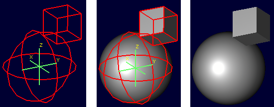
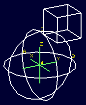
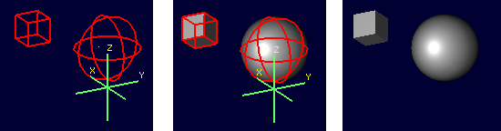
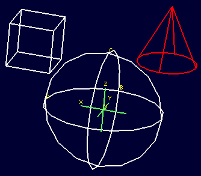
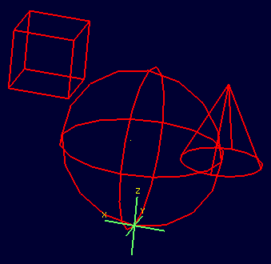

= Object Editing - the oed Command
CliffordYapp

[[_oed_basic_syntax_and_operations]]
== `oed` - Basic Syntax and Operations

The syntax of `oed` is fairly straightforward: footnote:[Note: lhs is an abbreviation for left
      hand side and rhs similarly stands for right hand side, given the
      assumption that a path is displayed as an ASCII stream with left
      to right text orientation (e.g. /toplevel/level-1/level-2/etc.)]
// <cmdsynopsis sepchar=" ">
//       <command>oed</command>
//       <arg choice="req" rep="norepeat"><replaceable>path_lhs</replaceable></arg>
//       <arg choice="req" rep="norepeat"><replaceable>path_rhs</replaceable></arg>
//     </cmdsynopsis>

`oed` serves primarily to make working with combinations and regions practical when there are large numbers of primitives involved.
It is of course possible to move primitives one by one to desired locations, but the process is extremely tedious for any non-trivial combination of primitives and the result is inflexible - for example,if the modeler wished to return the primitives in a combination to their original position after moving them _as primitives_ the process of moving them would need to be reversed one by one as well.
Barring being able to do everything perfectly the first time, individual primitive placement is impractical.

The notion of _path_ in this context refers to the tree of objects that traditionally makes up a CSG model.
Primitives will be combined with other primitives to make groups of objects, and the "path" to any individual shape within the combinations is described by the series of nodes in the tree that identify the object of interest.
For example, take a simple model of a lollipop:

image::../../articles/images/oed_fig01.png[]

If we examine the tree structure of this object, we see it resembles a file system - combinations and regions act a bit like "folders" which can hold other folders and files. footnote:[When tree structures are displayed, a "/" suffix denotes
      a combination and a "/R" denotes a combination that is a region.]

....

mged> tree lollipop
lollipop/
	u outer-candy-shell.r/R
		u outer-candy-sphere.c/
			u outer-candy-sphere.s
			- core.s
			- stick.s
		u outer-candy-cyl.c/
			u outer-candy-cyl.s
			- outer-candy-sphere.s
	u stick.r/R
		u stick.s
	u core.r/R
		u core.s
		- stick.s
....

In the "file system" of a BRL-CAD object combinations can hold combinations, regions and primitives.
Regions can hold combinations and primitives. footnote:[Regions will accept other regions as constructive arguments
      if given, but this is not good practice - BRL-CAD assumes a
      region is composed of combinations and primitives which share a
      material type.] Primitives are always leaves on the tree - they do not "contain" anything.
Combinations, regions, and primitives can have associated with them transformation data (sort of like metadata in a file system) that tells BRL-CAD how to manipulate the combination, region, or primitive in question.
It is this data that will be acted upon when the `oed` command is used.
So in the above example the full "path" of the outer-candy-sphere.c combination used in lollipop would be: 

....

/lollipop/outer-candy-shell.r/outer-candy-sphere.c
....

Note that if we wish to operate on this combination it is not enough to specify /lollipop/outer-candy-shell.r for the lhs and outer-candy-sphere.c for the rhs - _combinations and
    regions do not themselves have default control points._ In other words, if you want to rotate a combination there must be a point around which that rotation occurs - a combination will have no default point assigned.
This is the reason the rhs must always end with a  primitive - even though the intent is not to edit the primitive, information necessary for most operations on the combination will use information (such as default keypoint settings) that the primitive _does_ have.
So, 

  oed /lollipop/outer-candy-shell.r outer-candy-sphere.c is not enough.
Either 

  oed /lollipop/outer-candy-shell.r
      outer-candy-sphere.c/outer-candy-sphere.s or 

  oed /lollipop/outer-candy-shell.r outer-candy-sphere.c/core.s or 

  oed /lollipop/outer-candy-shell.r outer-candy-sphere.c/stick.s is needed to have `oed` actually enter edit mode on lollipop's outer-candy-sphere.c.
Because they are primitives in the outer-candy-sphere.c combination, outer-candy-sphere.s, core.s and stick.s are all legal - there will be illustrations later of the consequences of different primitive choices.

To demonstrate basic `oed` behavior an example is in order. footnote:[Bear in mind that these examples will be using very basic
      primitives for the sake of simplicity and it is not guaranteed
      that they will behave well for things like raytracing. In this
      document raytraced screenshots are included to aid visualization.
      Most of them are simple but there are sometimes a number of extra
      steps needed to actually allow the objects to be raytraced with
      the results seen here.]footnote:[path_lhs will be set to "/" for these
      simple cases - this means either we will be working with
      combinations that are not contained within any other combination/region
      or the intent is to transform every instance of
      the combination/region present regardless of where it appears in the
      tree structure.  "/" denotes the toplevel lhs path, or the "root of all
      trees" in the database.  Because every object in the database exists
      "on its own" at the top level as well as inside tree structures,
      operating on any object with a "/" path_lhs will always edit the matrix
      associated with that particular combination/region independently
      of any other transformations applied within tree structures.]

In an empty MGED session, create a new geometry database called __oed_examples.g__.
Enable the model coordinate axes display by entering the MGED command ``rset ax model_draw 1``.
Create two primitives: footnote:[This document will respect the normal BRL-CAD naming
      convention: use the .s extension for primitives, the .c
      extension for combinations below regions, and the .r extension
      for regions.  Combinations above regions have no extension.]

  in sphere.s sph 0 0 0 4

  in cube.s arb8 5 5 0 8 5 0 8 5 3 5 5 3 5 8 0 8 8 0 8 8 3 5 8 3 There should now be a sphere and a cube visible on the screen.
Next create a combination of these two primitives: 

  comb object1.c u sphere.s u cube.s After this command both the primitives and the combination are present in the display, which will result in overlaps.
Use the `B` command to reduce the display to just the combination. footnote:[The B abbreviation stands for "blast" -
      i.e. remove all objects from being displayed, and draw only the
      specified objects.]

  B object1.c

Before beginning the editing process, the `l` command (a.k.a.
the "list" command) can be used to view both the combination and its component primitives: 

[NOTE]
====
Note that the list command uses the lower case letter L (l) and not the numeral one (1).
====

....

mged> l object1.c
object1.c:  --
   u sphere.s
   u cube.s

mged> l sphere.s
sphere.s:  ellipsoid (ELL)
	V (0, 0, 0)
	A (4, 0, 0) mag=4
	B (0, 4, 0) mag=4
	C (0, 0, 4) mag=4
	A direction cosines=(0, 90, 90)
	A rotation angle=0, fallback angle=0
	B direction cosines=(90, 0, 90)
	B rotation angle=90, fallback angle=0
	C direction cosines=(90, 90, 0)
	C rotation angle=0, fallback angle=90

mged> l cube.s
cube.s:  ARB8
	1 (5, 5, 0)
	2 (8, 5, 0)
	3 (8, 5, 3)
	4 (5, 5, 3)
	5 (5, 8, 0)
	6 (8, 8, 0)
	7 (8, 8, 3)
	8 (5, 8, 3)
....

For the first task the goal is to shift both the sphere and the arb8 5 mm up the z axis.
First, select the combination for editing: 

  oed / object1.c/sphere.s

[NOTE]
====
Changes made during an object edit are not written to the database file unless and until they are accepted.
So if in the course of editing an object you make a mistake, you can type `reject` to revert to the pre-object-edit-mode values and exit object edit mode. 
====

The object should turn white, as below:

Once selected, use the `translate` command to shift the combination up the z axis. 

  translate 0 0 5 Both the sphere and the cube should have shifted together.

image::../../articles/images/oed_fig04.png[]

To accept the edit and end object edit mode type ``accept``: 

  accept

image::../../articles/images/oed_fig05.png[]

Now, use `l` to again examine the combination and its component primitives. 

....

mged> l object1.c
object1.c:  --
   u sphere.s [0,0,5]
   u cube.s [0,0,5]

mged> l sphere.s
sphere.s:  ellipsoid (ELL)
	V (0, 0, 0)
	A (4, 0, 0) mag=4
	B (0, 4, 0) mag=4
	C (0, 0, 4) mag=4
	A direction cosines=(0, 90, 90)
	A rotation angle=0, fallback angle=0
	B direction cosines=(90, 0, 90)
	B rotation angle=90, fallback angle=0
	C direction cosines=(90, 90, 0)
	C rotation angle=0, fallback angle=90

mged> l cube.s
cube.s:  ARB8
	1 (5, 5, 0)
	2 (8, 5, 0)
	3 (8, 5, 3)
	4 (5, 5, 3)
	5 (5, 8, 0)
	6 (8, 8, 0)
	7 (8, 8, 3)
	8 (5, 8, 3)
....

Notice that the primitives have not changed, but the combination now contains additional information.
It has recorded that both sphere.s and cube.s have been shifted up the z axis 5 mm.
Select object1.c again and apply a rotation as well: 

  oed / object1.c/sphere.s

  rot 0 0 90

  accept

Another check with `l` shows still more information stored at the combination level, but the primitives are again unchanged. 

....

mged> l object1.c
object1.c:  --
   u sphere.s az=90, el=0,  [0,0,5]
   u cube.s az=90, el=0,  [0,0,5]

mged> l sphere.s
sphere.s:  ellipsoid (ELL)
	V (0, 0, 0)
	A (4, 0, 0) mag=4
	B (0, 4, 0) mag=4
	C (0, 0, 4) mag=4
	A direction cosines=(0, 90, 90)
	A rotation angle=0, fallback angle=0
	B direction cosines=(90, 0, 90)
	B rotation angle=90, fallback angle=0
	C direction cosines=(90, 90, 0)
	C rotation angle=0, fallback angle=90

mged> l cube.s
cube.s:  ARB8
	1 (5, 5, 0)
	2 (8, 5, 0)
	3 (8, 5, 3)
	4 (5, 5, 3)
	5 (5, 8, 0)
	6 (8, 8, 0)
	7 (8, 8, 3)
	8 (5, 8, 3)
....

What if a modeler DID want the primitives to be the elements changed?  There exists a command called `push` that will perform this operation.
(So called because it "pushes" the transformations at the upper levels down to the primitives.)  Be warned that this change, once done, is difficult to undo.
Witness its effect on this example: 

  push object1.c

....

mged> l object1.c
object1.c:  --
   u sphere.s
   u cube.s

mged> l sphere.s
sphere.s:  ellipsoid (ELL)
	V (0, 0, 5)
	A (0, -4, 0) mag=4
	B (4, 0, 0) mag=4
	C (0, 0, 4) mag=4
	A direction cosines=(90, 180, 90)
	A rotation angle=270, fallback angle=0
	B direction cosines=(0, 90, 90)
	B rotation angle=0, fallback angle=0
	C direction cosines=(90, 90, 0)
	C rotation angle=0, fallback angle=90

mged> l cube.s
cube.s:  ARB8
	1 (5, -5, 5)
	2 (5, -8, 5)
	3 (5, -8, 8)
	4 (5, -5, 8)
	5 (8, -5, 5)
	6 (8, -8, 5)
	7 (8, -8, 8)
	8 (8, -5, 8)
....

Now the primitives have changed, and the combination is back to being just a boolean operation on primitives.
These operations COULD be undone, but there is no equivalent "pull" command to automatically undo them.
By design, `push` replaces the stored transformations by their results and removes the transformation information.
This means reversing a `push` requires additional transformations and another push to return things to their original state.
Any complex sequence of transformations becomes hard to undo - use `push` with care!

[[_right_hand_path_section]]
== Right Hand Path Selection - Reasons andImplications

Notice in the previous section that sphere.s was selected when using the `oed` command as part of the path_rhs.
What would the impact have been had cube.s been selected instead? 

Using the commands shown below, clear the old object1.c tree from MGED, re-insert the primitives, and make a combination as before.
This time make two objects using the same primitives, for later use.
At the moment, only the object2.c combination will be displayed. 

  killtree object1.c

  in sphere.s sph 0 0 0 4

  in cube.s arb8 5 5 0 8 5 0 8 5 3 5 5 3 5 8 0 8 8 0 8 8 3 5 8 3

  comb object1.c u sphere.s u cube.s

  comb object2.c u sphere.s u cube.s

  B object2.c In the previous section, the `translate` command was used to shift the object up the z axis.
That was a deliberate choice - `translate` moves to an absolute rather than a relative position.
Attempt the same operation, this time with the cube.s primitive selected: 

  oed / object2.c/cube.s

  translate 0 0 5

  accept

image::../../articles/images/oed_fig07.png[]

Compare the results to the previous section.
The model is indeed shifted up the z axis, but the distance is somewhat different and the cube now has one edge lined up with the z axis.
This is how `translate` works - it interprets its arguments as a _point_ at which the object should be positioned, rather than as a vector along which it should be shifted.
(To translate the object using a vector interpretation use the `tra` command instead - its arguments  (dx, dy, dz) are treated as how far to move something relative to the current position.)   In the previous section, the sphere's origin was the reference point.
Now, the cube's first coordinate is being moved to the same absolute position - with different overall results for the model. 

As one further illustration, attempt a `rot` command with the cube selected and then again with the sphere selected: 

  oed / object2.c/cube.s

  rot 0 90 0

  accept

  oed / object2.c/sphere.s

  rot 0 90 0

  accept The first `rot` command rotated the model around a line parallel to the y axis using the first coordinate of cube.s.
The second rotation started from the results of the previous rotation and rotated again around a line parallel to the y axis, but this time using the origin of sphere.s. 

The `l` command provides a look at the final result:

....

mged> l object2.c
object2.c:  --
   u sphere.s az=180, el=0,  [-5,5,5]
   u cube.s az=180, el=0,  [-5,5,5]
....

Selection of a particular primitive when using `oed` will depend on the particular situation.
Combinations do not have control points of their own, and thus cannot provide any basis for these operations - a primitive MUST be supplied for every `oed` operation. 

[[_flexible_manipulation]]
== Flexible Manipulation with _keypoint_

It might be reasonable to expect the `oed` command to use the center of the combination bounding box as a default if no primitive is supplied and/or take as an optional parameter an explicit keypoint setting, but this is not the current behavior of BRL-CAD as of version 7.12 - a primitive is required.
As seen in the previous section, the `oed` uses the specified primitive to select a point from which translations/rotations/etc.
are defined.
BRL-CAD's term for this point is the __keypoint__.
For cases where it is not practical to select a primitive that will provide the correct keypoint, BRL-CAD does offer an option for explicitly setting the keypoint. 

For example, to rotate object2.c around the z axis intersecting point (2,2,0) the keypoint must be set explicitly - this is not a point that can be selected by identifying a primitive. 

First, check the current keypoint value: footnote:[Note that keypoint is a meaningless concept until in object
      edit mode, so the first step is to enter that mode.]

  oed / object2.c/sphere.s

  keypoint

  (null) (-5, 5, 5) In order to set a new keypoint, we simply supply an x y z style coordinate option to the keypoint command: 

  keypoint 2 2 0

  keypoint

  user-specified (2, 2, 0) Notice that the keynote report identifies this keypoint as user-specified.
Having set this new keypoint, we can now rotate about it: 

  rot 0 0 90

  accept

....

mged> l object2.c
object2.c:  --
   u sphere.s az=270, el=0,  [5,9,5]
   u cube.s az=270, el=0,  [5,9,5]
....

Notice that it is getting increasingly difficult to identify the transformations that will restore the original shape positions.
There is no keypoint history mechanism so remember to carefully track what is done if retracing the steps performed on an object is important.

[[_sub_combination_editing]]
== Sub-Combination Editing - using Left Hand PathSelection

The importance of the _path_lhs_ portion of the `oed` command is better understood in the case of more complex objects.
To illustrate such a case, a new shape and additional combination structures are added: 

  in cone.s trc -4 0 4 0 0 4 2 .01

  comb object3.c u cone.s u object1.c

  r bigobject.r u object1.c u object3.c

  B bigobject.r

image::../../articles/images/oed_fig10.png[]

....

mged> tree bigobject.r
bigobject.r/R
	u object1.c/
		u sphere.s
		u cube.s
	u object3.c/
		u cone.s
		u object1.c/
			u sphere.s
			u cube.s
....

The first goal is to translate object1.c inside bigobject.r 4mm in the positive z direction without impacting any other part of the model.
This means the object1.c inside object3.c inside bigobject.r should NOT be changed.
A first attempt might be to work directly with object1.c: 

....

mged> l object1.c
object1.c:  --
   u sphere.s
   u cube.s
....

  oed / object1.c/sphere.s

  Error: Unable to find solid matching path

An error is returned, because this command attempts to edit object1.c as a top level object and it is not currently in display as a top level object due to the previous `B` cleanup.
However, MGED does not _force_ object1.c out of the display when bigobject.r is displayed.
Assuming it was still present (simulate this by entering `B bigobject.r object1.c` into the MGED prompt) the previous command would have a different result: 

  B bigobject.r object1.c

  oed / object1.c/sphere.s

BRL-CAD is now in object edit mode, and visually it looks like it is highlighting precisely the part of the model targeted for translation.
However, when translated: 

  tra 0 0 4

  accept

  B bigobject.r object1.c

BOTH the object1.c present in bigobject.r and the definition of object1.c in object3.c have been translated - only one instance of the sphere and cube combination is visible.
This is a subtle problem, but remember the original goal was to move ONLY the object1.c inside bigobject.r - this technique moved more than that.
It would be especially problematic if a modeler didn't realize that object1.c was still in the display (assuming it is intended only as a sub-object for other objects) and the above command visually "did the right thing" - before re-running the `B` command the result would look correct.
There are two reliable hints something is wrong.
If the `l` is run on bigobject.r, no transformation matrix is observed next to object1.c: 

....

mged> l bigobject.r
bigobject.r:  REGION id=1005  (air=0, los=100, GIFTmater=1) --
   u object1.c
   u object3.c
....

and examining the `l` readout for all object1.c instances the results are identical, when the bigobject.r's object1.c was intended to change: 

....

mged> l bigobject.r/object1.c
bigobject.r/object1.c:  --
   u sphere.s [0,0,4]
   u cube.s [0,0,4]

mged> l bigobject.r/object3.c/object1.c
bigobject.r/object3.c/object1.c:  --
   u sphere.s [0,0,4]
   u cube.s [0,0,4]

mged> l object1.c
object1.c:  --
   u sphere.s [0,0,4]
   u cube.s [0,0,4]
....

The correct way to do the above task would be to use _path_lhs_ to identify precisely where the transformation is to occur.
Remember in the beginning of the article the lollipop example showed instances of lhs path usage - this is an example where it is needed.
First, object2.c must be returned to its previous position: 

  oed / object1.c/sphere.s

  tra 0 0 -4

  accept

  B bigobject.r Next the correct commands are entered: 

  oed /bigobject.r object1.c/sphere.s

  tra 0 0 4

  accept

  B bigobject.r

image::../../articles/images/oed_fig13.png[]

Visually it is already clearer - there are now two offset object1.c combinations in the display.
Repeating the `l` command also shows the expected results, with the combination showing a transformation matrix and the object1.c reports showing differences: 

....

mged> l bigobject.r
bigobject.r:  REGION id=1005  (air=0, los=100, GIFTmater=1) --
   u object1.c [0,0,4]
   u object3.c

mged> l bigobject.r/object1.c
bigobject.r/object1.c:  --
   u sphere.s [0,0,4]
   u cube.s [0,0,4]

mged> l bigobject.r/object3.c/object1.c
bigobject.r/object3.c/object1.c:  --
   u sphere.s
   u cube.s

mged> l object1.c
object1.c:  --
   u sphere.s
   u cube.s
....

There is a lot of potential here for unintended consequences.
On the other hand, in some cases the modeler may _want_ all instances of object1.c to pick up the changes.
Awareness of the dangers inherent to this type of operation is an important skill for a modeler to acquire. footnote:[(Obviously, this example was intended for behavior
      demonstration and not as an example of best-practice modeling.)]

== Summary

The major points of the `oed` command are: 

* `oed` is the standard tool when working with combinations and regions instead of primitives. 
* Object edit mode does not alter primitives directly but instead works on a transformation matrix that BRL-CAD uses when interpreting the primitive. 
* BRL-CAD requires that a primitive shape be supplied at the end of the _path_rhs_ for all object edit mode operations. 
* `push` is used to force changes corresponding to the transformation down to the primitives, but the operation is destructive in that it replaces the previous information defining the primitive. 
* _keypoint_ is used in object edit mode as the point moved by `translate` operations and around with rotations occur - it is set from the primitive supplied to `oed` but can also be set manually when in object edit mode with the `keynote`	  command. 
* When editing objects inside other objects it is important to remember to use _path_lhs_ to precisely identify the shape to be worked on - subtle and messy errors are possible if the wrong path is used. 
* When using `oed` in a script, the object must be in view so a `B` or `draw` command to select the object must be entered before using the `oed` command on it. 

// <acknowledgements>
//   <para>
//     Thanks to Christopher Sean Morrison, Paul Tanenbaum and Ruth Foutz for proofreading, suggestions and corrections.
//   </para>
// </acknowledgements>
